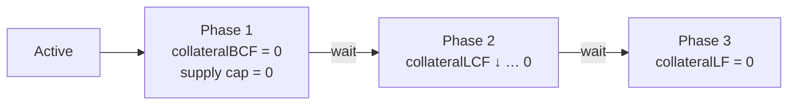

# Delisting Procedure

How to respond when a collateral asset or its price feed stops being safe: which tools to use, in what order, how fast, and what the market looks like at each step. Five real-world triggers are covered, from a feed deprecation announced months ahead to a token exploit in progress.

> This is the operational playbook. For the mechanics behind each step, see [Collateral Delisting](collateral-delisting.md) (what each factor does) and [Pauses](pauses.md) (pauses and deactivation).

---

## Table of Contents

1. [Toolbox](#1-toolbox)
2. [Deactivation: the Emergency Brake](#2-deactivation-the-emergency-brake)
3. [The Standard Path](#3-the-standard-path)
4. [How a Bad Price Feed Hurts the Market](#4-how-a-bad-price-feed-hurts-the-market)
5. [Scenarios](#5-scenarios)
6. [Summary](#6-summary)
7. [Before Each Step](#7-before-each-step)

---

## 1. Toolbox

Every response is built from the same tools. What differs between them is **who** can use them and **how fast**:

| Tool | Who | Takes effect | What it does |
|---|---|---|---|
| `pauseCollateralAssetSupply` / `Transfer` / `Withdraw` | Pause guardian or governor | **Immediately** | Stops one action for one asset |
| `deactivateCollateral` | Pause guardian | **Immediately** | Stops supply and transfer of the asset, and blocks borrowers who hold it |
| Extended pauses (`pauseBorrowersWithdraw`, …) | Pause guardian or governor | **Immediately** | Stops one kind of action market-wide |
| collateralBCF / collateralLCF / collateralLF / supply cap | Governor, or market admin | **After a timelock**, through an upgrade | Changes the asset's role in borrowing and liquidation |
| Replace the price feed (`updateAssetPriceFeed`) | Governor only | **After a full governance vote** | Points the asset to a different oracle |

Factor changes reach the market through `Configurator` → `CometProxyAdmin.deployAndUpgradeTo`. The market admin path goes through the `MarketUpdateTimelock` (at least 2 days). The governor path takes a full proposal cycle (voting plus timelock). **The market admin cannot replace a price feed.** Only governance can.

So every incident has two clocks: what the guardian can do **now**, and what governance can do **in days**. A good response uses the first to limit damage until the second lands.

<a href="#table-of-contents">⬆ Back to Table of Contents</a>

---

## 2. Deactivation: the Emergency Brake

Deactivation is for **a problem that can damage the market right now**: the asset is being minted out of thin air, has lost its peg, or its contract has been taken over. It is the only tool that acts immediately *and* reaches positions that already exist.

| Deactivation does | Deactivation does not |
|---|---|
| Stop new supply of the asset | Change any factor |
| Stop transfers of the asset | Affect liquidation: `isLiquidatable` and `absorb` ignore it |
| Block every borrower who relies on the asset: no new borrows, no withdrawing other collateral, no base transfers (`TokenIsDeactivated`) | Stop holders from withdrawing the asset |
| | Fix a broken price feed |

Borrowers holding a deactivated asset can repay, withdraw all of the asset (if their other collateral covers the debt), or wait for liquidation. Accounts without debt can simply withdraw.

Only the **governor** can reactivate. That is deliberate: the guardian can pull the brake alone, but trusting the asset again needs a vote.

> The borrower block fires only when the collateral check actually reaches the deactivated asset. If the borrower's lower-index assets already cover the debt, the action goes through. This is harmless: that debt is not backed by the deactivated asset.

<a href="#table-of-contents">⬆ Back to Table of Contents</a>

---

## 3. The Standard Path

When there is time, the asset is retired gradually. Each step takes away one role and gives users a window to react before the next:

| Phase | Change | User sees | Goal |
|---|---|---|---|
| **1. Stop new borrows** | collateralBCF → 0, supply cap → 0 | The asset gives no borrowing power and can't be supplied. Positions stay safe. | Freeze exposure, start the clock |
| **2. Withdraw protection** | collateralLCF lowered step by step, down to 0 | The asset protects less and less against liquidation. At 0 it protects nothing, and positions relying on it are liquidated and **the asset is seized** into reserves. | Push users to move out, then take what's left |
| **3. Release** | collateralLF → 0 | The asset is ignored by liquidation. Anyone still holding it keeps it. | Make the asset fully inert |

**Phase 2 is where the design choices are.** Each collateralLCF step is a real liquidation at a **real price**. A user who ignores it loses the asset at its market value, minus the usual penalty, and gets any surplus back as base. The final step to 0 is different: the asset is **seized at $0 credit** and reserves pay the debt. A position that ignored every earlier step loses the whole asset.

How many steps, and how long between them, depends on how much debt still relies on the asset (see [section 7](#7-before-each-step)). A few large steps are fine for a small exposure. A large one deserves more, smaller steps.

**Phase 3 protects the holders who are left.** After phase 2, the only holders are accounts without debt or accounts covered by other collateral. If one of them is later liquidated for an unrelated reason, phase 3 makes sure the delisted asset is not seized for $0 credit along the way.

> **Stepping down collateralLCF needs a working price feed.** Every step above 0 still reads the asset's price in liquidation. With a broken feed, collateralLCF has to go straight to 0 (see [section 4](#4-how-a-bad-price-feed-hurts-the-market)).

<a href="#table-of-contents">⬆ Back to Table of Contents</a>

---

## 4. How a Bad Price Feed Hurts the Market

Comet reads prices through `getPrice`, which reverts with `BadPrice` when the answer is 0 or negative, and bubbles up any revert from the feed itself. It does **not** check how old the price is. A feed that stops updating keeps reporting its last price, and the market keeps using it.

So from the market's point of view:

- **A zero price and a reverting feed are the same thing:** every read of the price reverts.
- **A stale feed is invisible:** nothing reverts, but the price is wrong.

A reverting read blocks only the functions that actually read the price. Which ones depends on the factors:

| Reads the price | For an account that | Blocked unless | Consequence while blocked |
|---|---|---|---|
| `isBorrowCollateralized` | Has debt and holds the asset | collateralBCF = 0 | The borrower can't borrow, withdraw collateral, or transfer. Repay and supply still work. |
| `isLiquidatable`, `absorb` | Has debt and holds the asset | collateralLCF = 0 | **The account cannot be liquidated.** Bad debt can grow unseen. |
| `quoteCollateral`, `buyCollateral` | — (this asset only) | never skipped | Reserves of this asset cannot be sold |
| `Configurator.deploy` (`decimals()`) | — | never skipped | **No upgrade of the market can be built** |

Three takeaways shape every oracle scenario:

1. **The liquidation block is the dangerous one**, and only collateralLCF = 0 or a new feed removes it. Deactivation does not help here.
2. **collateralLCF can't be stepped down** while the feed reverts: any value above 0 still reads it. It goes to 0 in one step.
3. **If `decimals()` also reverts, the feed has to be replaced before any factor can change**, because every upgrade calls it. That makes the upgrade governance-only.

<a href="#table-of-contents">⬆ Back to Table of Contents</a>

---

## 5. Scenarios

### 5.1 Price feed will be deprecated

**Trigger:** the oracle provider announces that the feed will stop on a given date.
**Risk:** after that date the feed either freezes (a stale price, which the market can't detect) or reverts (section 4). There is time, but there is a **deadline**.

**First choice: replace the feed.** If a trusted feed for the same asset exists, governance switches to it and the asset stays listed. Nothing else is needed.

**If there is no replacement**, follow the standard path, timed backwards from the deadline:

| When | Step |
|---|---|
| On announcement | Phase 1: collateralBCF → 0, supply cap → 0 |
| Until the deadline | Phase 2: step collateralLCF down while the price is still live |
| **Before the deadline** | collateralLCF = 0. After this, liquidation never reads the feed again. |
| After | Phase 3: collateralLF → 0. If `decimals()` will stop working, replace the feed with a placeholder that still reports 8 decimals, so future upgrades can be built. |

No deactivation: the asset itself is fine, and users need to be able to move out of it freely.

### 5.2 Price feed returns 0

**Trigger:** the feed answers with 0 or a negative price, so every read reverts with `BadPrice`.
**Risk:** borrowers relying on the asset are frozen, and **their positions can't be liquidated**.

A zero price is ambiguous. It can be a temporary data fault that fixes itself, or it can be the feed reporting a real collapse. Respond in two stages:

| When | Step |
|---|---|
| Immediately | `pauseCollateralAssetSupply(i, true)`. No new exposure while the cause is unknown. |
| Immediately, if the zero looks real | Treat it as an exploit (5.4): deactivate. |
| Days | A correct feed exists → **replace the feed**. Otherwise, **collateralBCF → 0 and collateralLCF → 0 in one upgrade**, and keep collateralLF > 0. |
| Later | Phase 3: collateralLF → 0 |

Don't deactivate for what looks like a data fault. Borrowers are already frozen by the revert, and deactivating adds nothing except a block that stays until governance lifts it, even after the feed recovers.

### 5.3 Price feed reverts

**Trigger:** the feed contract reverts, because it was decommissioned, paused, or broken by an upgrade on the provider's side.
**Risk:** the same as 5.2, with no chance of fixing itself.

| When | Step |
|---|---|
| Immediately | `pauseCollateralAssetSupply(i, true)` |
| Days | A replacement exists → **replace the feed**. Otherwise, collateralBCF → 0 and collateralLCF → 0 in one upgrade, collateralLF kept > 0. |
| Later | Phase 3: collateralLF → 0 |

Check `decimals()` first. If it reverts too, **no upgrade can be built** until the feed is replaced. The factor change and the feed replacement must then go in the same governance proposal: a working feed, or a placeholder reporting 8 decimals.

With collateralLCF at 0, liquidations go through without the price. Positions that relied on the asset are liquidated, the asset is seized at $0 credit, and reserves cover the debt. There is no gradual phase 2 here. That is the cost of having no price.

### 5.4 Token exploit

**Trigger:** the token is compromised: unlimited minting, a bridge hack, a depeg, or a malicious upgrade of the token contract.
**Risk:** an attacker supplies worthless tokens and borrows real base against them. The feed may still report the old price for a while, so the market cannot see the loss.

**This is the case deactivation exists for.** Act first, then clean up:

| When | Step |
|---|---|
| **Immediately** | `deactivateCollateral(i)`. Supply, transfer and borrowing against the asset stop in the same transaction. |
| Immediately, if the extent is unclear | Extended pauses such as `pauseBorrowersWithdraw` + `pauseBorrowersTransfer`, until it is clear no other path is affected |
| Immediately, if the token's own transfer logic is malicious | `pauseCollateralAssetWithdraw(i, true)`. Otherwise leave withdraw open so honest holders can leave. |
| Days | collateralBCF → 0 and collateralLCF → 0 in one upgrade, collateralLF kept > 0 |
| Later | Phase 3: collateralLF → 0 |

Why collateralLCF goes straight to 0: while it is above 0 and the feed still shows the old price, **positions backed by the worthless token look healthy**. Setting it to 0 makes those positions liquidatable, so the loss is recognized and capped instead of growing. Keeping collateralLF above 0 means the seized tokens end up in reserves, which keeps something to sell if the token ever recovers.

The asset stays deactivated after cleanup. See [6. Summary](#6-summary) for when to lift it.

### 5.5 Token will be deprecated

**Trigger:** the issuer is retiring the token (a migration to a new version, the end of a product) or its liquidity is drying up. The feed still works.
**Risk:** low today. The goal is an orderly exit with the least loss to users.

This is **the full standard path**, with generous waits:

| When | Step |
|---|---|
| Announcement | Communicate the timeline to users |
| Phase 1 | collateralBCF → 0, supply cap → 0 |
| Phase 2 | Step collateralLCF down in several steps, with time between each. Each step liquidates the positions that didn't react, at the real price. The last step, to 0, seizes what is left at $0 credit. |
| Phase 3 | collateralLF → 0 |

No pauses, no deactivation: users must be able to supply other collateral, withdraw this one, and move freely between steps.

<a href="#table-of-contents">⬆ Back to Table of Contents</a>

---

## 6. Summary

| Scenario | Immediate (guardian) | Deactivate | Pace | Phase 2 | Replace feed? |
|---|---|---|---|---|---|
| 5.1 Feed deprecated | — | ✗ | Gradual, with a deadline | Stepped, reaches 0 before the deadline | Preferred |
| 5.2 Feed returns 0 | Pause supply | Only if the zero is real | Fast | collateralLCF → 0 in one step | Preferred |
| 5.3 Feed reverts | Pause supply | ✗ | Fast | collateralLCF → 0 in one step | Preferred. Required if `decimals()` reverts. |
| 5.4 Token exploit | **Deactivate** | ✓ | Fast | collateralLCF → 0 in one step | — |
| 5.5 Token deprecated | — | ✗ | Gradual | Stepped | — |

**Ending a deactivation.** After phase 3 the asset is inert: all factors are 0, and its supply cap is 0. Deactivation now only does one thing: it blocks borrowers who still hold some of the asset until they withdraw all of it. Governance can leave that in place, forcing cleanup, or `activateCollateral` to lift it. Reactivating a fully delisted asset gives it no role back: the factors stay 0, and the supply cap still blocks deposits.

<a href="#table-of-contents">⬆ Back to Table of Contents</a>
