# Liquidation

How under-collateralized positions are wound down in the Comet protocol — the roles involved, the contracts that do the work, and the math behind each path.

> Reference contracts: [`CometWithExtendedAssetList`](../contracts/CometWithExtendedAssetList.sol), [`liquidation-module/`](../contracts/liquidation-module/), [`dex-adapters/`](../contracts/dex-adapters/).

---

## Table of Contents

1. [Overview](#1-overview)
2. [Collateral Value and Health Factor](#2-collateral-value-and-health-factor)
3. [Mechanism of Liquidation](#3-mechanism-of-liquidation)
4. [Structure of the Protocol](#4-structure-of-the-protocol)
5. [Seizure Calculation](#5-seizure-calculation)
6. [Default Liquidation](#6-default-liquidation)
7. [DEX Liquidation](#7-dex-liquidation)
8. [Benefits for Liquidators](#8-benefits-for-liquidators)
9. [Events](#9-events)
10. [Interfaces](#10-interfaces)

<!-- More chapters are added here as they are written. -->

---

## 1. Overview

Every borrower in Comet locks up **collateral** (volatile assets such as WETH or WBTC) in order to borrow the **base asset** (a stable asset such as USDC). The protocol only ever lends out a fraction of the collateral's value, keeping a safety buffer between what a borrower owes and what their collateral is worth.

That buffer is not permanent. Collateral prices fall, and borrow balances grow over time as interest accrues. When the two lines cross — the debt grows large enough relative to the collateral that the buffer is gone — the position is **under-collateralized**. If nothing is done, the debt could exceed the collateral entirely, leaving the protocol with a loss that lenders ultimately absorb.

**Liquidation is the mechanism that closes that gap before it becomes a loss.** When a position crosses the liquidation threshold, its collateral is seized and used to repay its debt, restoring the account to a safe state (or, in the worst case, capping the protocol's loss as early as possible). This is what keeps the base asset fully backed and lenders able to withdraw.

In Comet, this work is not done inside the core market contract. It lives in a dedicated **Liquidation Module**, which reads the account's position from the market, decides how much of which collateral to seize, and writes the result back through the market's liquidation hooks.

### Who and what is involved

| Actor / Component | Role |
|---|---|
| **Borrower** | Supplies collateral and borrows the base asset. Their position is what gets liquidated when it becomes unhealthy. |
| **Market** (`CometWithExtendedAssetList`) | Holds all balances and prices. Knows each account's debt and collateral, and exposes the hooks the module calls to move value. |
| **Liquidation Module** | The brain of the operation. Checks whether an account is liquidatable, computes the **seizure plan** (which collateral to take, and how much), and instructs the market to seize collateral and reduce debt. |

The diagram below shows the core idea, without the DEX adapter or the routing details (those come in later chapters):

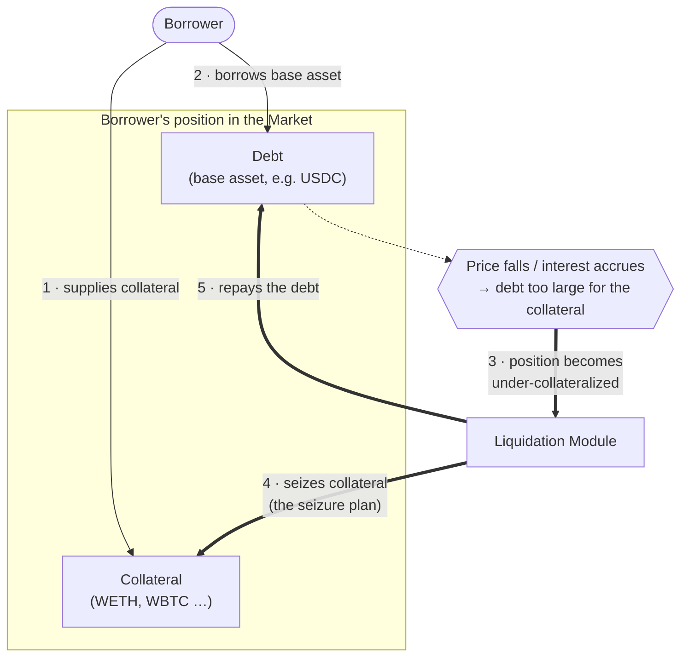

**In words:** a borrower supplies collateral and borrows against it *(steps 1–2)*. Later, a price move or accrued interest pushes the debt past what the collateral can safely support *(step 3)*. The Liquidation Module then seizes just enough collateral and uses its value to pay down the debt *(steps 4–5)* — bringing the account back to health, or closing it out entirely when the collateral no longer covers what is owed.

The chapters that follow break down *when* an account becomes liquidatable, *how much* collateral the module decides to seize, and the different *paths* a liquidation can take.

<div align="right"><a href="#table-of-contents">⬆ Back to Table of Contents</a></div>

---

## 2. Collateral Value and Health Factor

To decide whether an account can be liquidated, the module needs a single question answered: **is the account's collateral still worth enough to back its debt?** Answering it means putting a number on the collateral and a number on the debt, and comparing them. This chapter builds those two numbers up from the pieces the protocol stores, then combines them into the **health factor** — the one value that tells us, at a glance, how safe or unsafe a position is.

### 2.1 The ingredients: prices and factors

Three things go into valuing a piece of collateral, and each comes from a specific place:

| Ingredient | Where it comes from | Meaning |
|---|---|---|
| **Balance** | `comet.userCollateral(account, asset).balance` | How much of the collateral the account holds, in the token's own units. |
| **Price** | `getPrice(asset.priceFeed)` — a Chainlink-style feed | The asset's USD price, always at **8 decimals** (`PRICE_SCALE = 1e8`). |
| **liquidateCollateralFactor** | Asset config (`AssetInfo.liquidateCollateralFactor`) | The share of the collateral's value that counts toward the **liquidation threshold**, at **18 decimals** (`FACTOR_SCALE = 1e18`). An 85% factor is stored as `0.85e18`. |

Comet defines three factors per asset, and it is important not to confuse them — only one of them decides liquidation:

- **borrowCollateralFactor** — how much you are allowed to *borrow* against the asset. This gates opening a position; it is **not** used to decide liquidation.
- **liquidateCollateralFactor** — the **liquidation threshold**. This is the factor used in the health-factor check below. It is always ≥ `borrowCollateralFactor`, which is what creates the safety buffer between "can't borrow more" and "gets liquidated".
- **liquidationFactor** — the penalty applied to collateral *once it is being seized* (how much debt each unit of seized collateral repays). This one belongs to the seizure math and is covered in a later chapter, not here.

> This chapter is only about the **liquidation threshold**, so every "weighted" value below uses **liquidateCollateralFactor**.

### 2.2 The collateral value formula

For a **single** collateral asset, the module computes a raw USD value and then weights it by the liquidation factor. In Comet's fixed-point math (`SeizureCalculations._getLiquidity`):

```ts
// Raw USD value of the holding, carried at the 1e8 price scale.
//   mulPrice(n, price, fromScale) = n * price / fromScale
const collateralValue = mulPrice(balance, price, asset.scale);

// Weight it by the liquidation threshold (LCF), 1e18-scaled.
//   mulFactor(n, factor) = n * factor / 1e18
const weightedValue = mulFactor(collateralValue, asset.liquidateCollateralFactor);
```

Written as plain formulas (all USD values live at the `1e8` price scale):

```ts
collateralValue_i = balance_i × price_i / scale_i
weightedValue_i   = collateralValue_i × liquidateCollateralFactor_i / 1e18
```

An account can hold several collaterals at once, so the module loops over every asset the account has (`assetsIn` tracks which ones) and sums the weighted values. This sum is the account's **liquidity** — the total collateral value that counts against its debt:

```ts
liquidity = Σ  ( balance_i × price_i / scale_i ) × liquidateCollateralFactor_i / 1e18
           over every collateral i the account holds
```

Two details worth calling out, because they are deliberate:

- **Assets with `liquidateCollateralFactor == 0` are skipped entirely** — including their price lookup. A collateral that contributes nothing to the threshold should never be able to *block* the check by having a broken or stale oracle. Skipping it keeps liquidation possible.
- The **debt** side is valued the same way, using the base asset's price and scale:

```ts
debtValue = presentValue(principal) × basePrice / baseScale
```

where `presentValue(principal)` is the borrow balance *including accrued interest* up to the current block — not the amount originally borrowed.

### 2.3 The health factor

With those two numbers — `liquidity` (weighted collateral) and `debtValue` — the health factor is simply their ratio, scaled to `1e18`:

```
                liquidity × 1e18
health factor = ─────────────────
                    debtValue
```

The health factor is a **1e18-scaled** number, so `1.0` is stored as `1e18`. Reading it is straightforward:

| Health factor | Meaning |
|---|---|
| **HF ≥ 1** (`≥ 1e18`) | Collateral still covers the debt at the liquidation threshold — **safe**, cannot be liquidated. |
| **HF < 1** (`< 1e18`) | Weighted collateral has fallen below the debt — **liquidatable**. |

This is exactly the test `isLiquidatable` performs, just arranged to avoid a division. Instead of computing the ratio, it compares the two values directly:

```ts
// CoreLiquidationModule.isLiquidatable — debt is negative, liquidity is positive.
// debt + liquidity < 0   ⇔   liquidity < debtValue   ⇔   HF < 1
return debt + liquidity < 0n;
```

There is one more health-factor value to know about, used later by **partial** liquidation: `TARGET_HEALTH_FACTOR = 1.05e18`. When the module only partially liquidates an account, it seizes *just enough* collateral to lift the health factor back up to `1.05` - a small margin above the `1.0` threshold, so a tiny further price move doesn't immediately push the account underwater again. The seizure chapter covers how that target drives the amount seized.

### 2.4 Worked example

Let's put real numbers through the formulas. A single-collateral position, the way you'd model it on paper.

**The market**

| Parameter | Value |
|---|---|
| Base asset | USDC — 6 decimals (`baseScale = 1e6`), price `$1.00` |
| Collateral | WETH — 18 decimals (`scale = 1e18`), price `$2,000` |
| WETH `borrowCollateralFactor` | `0.80` (80%) |
| WETH `liquidateCollateralFactor` | `0.85` (85%) — the liquidation threshold |

**The position.** A borrower supplies **10 WETH** and borrows **15,000 USDC**.

**Step 1 — value the collateral.**

```
collateralValue = 10 WETH × $2,000 = $20,000
weightedValue   = $20,000 × 0.85   = $17,000     ← counts toward the threshold
```

**Step 2 — value the debt.**

```
debtValue = 15,000 USDC × $1.00 = $15,000
```

**Step 3 — health factor.**

```
HF = $17,000 / $15,000 = 1.133   →   1.133e18
```

`HF > 1`, so the position is **safe**. The borrower is using $15,000 of a $17,000 threshold — there's still headroom.

**Now the price of ETH falls.** Suppose WETH drops from `$2,000` to `$1,700`:

```
collateralValue = 10 × $1,700      = $17,000
weightedValue   = $17,000 × 0.85   = $14,450
HF              = $14,450 / $15,000 = 0.963   →   0.963e18
```

`HF < 1` — the position is now **liquidatable**. The weighted collateral ($14,450) no longer covers the $15,000 debt.

**Where exactly does it flip?** Setting `HF = 1` and solving for the ETH price `P`:

```
10 × P × 0.85 = $15,000   →   P = $15,000 / 8.5 ≈ $1,764.71
```

So the moment WETH trades below **≈ $1,764.71**, this account crosses the liquidation threshold. (In practice the debt also creeps up as interest accrues, so the real trigger price rises slowly over time — `presentValue(principal)` captures that.)

The same computation in contract terms:

```ts
// exp(n, d) builds a scaled bigint: prices use d = 8, factors d = 18, token amounts d = decimals
const collateralValue = mulPrice(exp(10, 18), exp(1_700, 8), exp(1, 18)); // exp(17_000, 8)  ($17,000)
const weightedValue   = mulFactor(collateralValue, exp(0.85, 18));        // exp(14_450, 8)  ($14,450)
const debtValue       = mulPrice(exp(15_000, 6), exp(1, 8), exp(1, 6));   // exp(15_000, 8)  ($15,000)

// HF = weightedValue * 1e18 / debtValue = 0.963e18  →  < 1e18  →  liquidatable
const liquidatable = weightedValue < debtValue;                          // true
```

### 2.5 Summary

- Every collateral is valued as **`balance × price / scale`**, then weighted by its **`liquidateCollateralFactor`** (the liquidation threshold). Summed across all of an account's collaterals, this is its **liquidity**.
- The **debt** is valued the same way from the borrow's `presentValue` (interest included) and the base asset's price.
- The **health factor** is `liquidity / debtValue`, carried at `1e18`. **`HF ≥ 1` is safe; `HF < 1` is liquidatable** — and that is precisely what `isLiquidatable` checks.
- Don't confuse the three factors: **borrowCollateralFactor** gates borrowing, **liquidateCollateralFactor** decides liquidation, **liquidationFactor** prices the seizure (next chapters).
- Partial liquidation later aims for **`TARGET_HEALTH_FACTOR = 1.05`**, restoring a small safety margin rather than stopping exactly at `1.0`.

<div align="right"><a href="#table-of-contents">⬆ Back to Table of Contents</a></div>

---

## 3. Mechanism of Liquidation

Chapter 2 gave us the two numbers that matter: the account's **weighted collateral** (its liquidity, using `liquidateCollateralFactor`) and its **debt value**. A position is liquidatable the moment the collateral side can no longer cover the debt side:

```ts
weightedCollateral < debtValue          // liquidatable
```

Nothing about a position is fixed, though. Both sides of that inequality drift over time, and the protocol never "pushes" an account into liquidation — it simply re-evaluates the inequality whenever asked. This chapter first lists **what makes a healthy position drift into a liquidatable one**, then walks through the exact function the protocol uses to make the call: `isLiquidatable`.

### 3.1 Why a position becomes liquidatable

It helps to keep one running frame in mind. The **liquidation threshold** is the collateral value weighted by its liquidation factor — the largest debt the position is allowed to carry:

> **Example.** A borrower supplies **$100** of collateral in a market where that collateral's `liquidateCollateralFactor` is **86%**:
>
> - The position is **safe** while borrowed value **≤ $86**
> - The position becomes **liquidatable** once borrowed value **> $86**

Anything that pulls the threshold **down** or pushes the **debt** up can cross that line. There are four independent triggers.

**1 · The collateral price falls.** The most common trigger. The threshold is a percentage *of the collateral's value*, so when the collateral is worth less, the threshold shrinks with it.

```
$100 collateral, borrowed $80, threshold 86% → $86   (safe)
collateral price drops 12% → collateral now $88
new threshold = 86% × $88 = $75.68
borrowed $80 > $75.68 → liquidatable
```

**2 · The base-asset price rises.** Debt is denominated in the base asset, and its value is `borrowAmount × basePrice`. If the base asset appreciates against the collateral, the *value* of the same debt grows even though the borrowed amount is unchanged.

```
$100 collateral, threshold $86, borrowed 80 units of base @ $1.00 → debt $80   (safe)
base price rises to $1.10 → debt value = 80 × $1.10 = $88
$88 > $86 → liquidatable
```

**3 · Debt grows from accrued interest.** Even with every price frozen, a borrow balance increases every second as interest accrues. `presentValue(principal)` reflects the current balance including that interest, so a position can drift over the threshold on its own, with no market move at all.

```
$100 collateral, threshold $86, borrowed $85   (safe)
interest accrues over time → borrow balance grows to $87
$87 > $86 → liquidatable
```

**4 · The collateral is deactivated (its factor goes to 0).** Governance can set an asset's `liquidateCollateralFactor` to **0** — for example when winding down support for a collateral. From that point the asset contributes **nothing** to the threshold: it is skipped entirely in the liquidity sum. An account leaning on that collateral can become liquidatable instantly, with no price or interest change.

```
$100 collateral, factor 86% → threshold $86, borrowed $80   (safe)
governance sets liquidateCollateralFactor = 0 for that asset
threshold contribution from it = $0
borrowed $80 > $0 → liquidatable
```

In every case the cause is different, but the test the protocol runs is identical — it re-checks the same inequality. The rest of this chapter is that test.

### 3.2 How the protocol decides: `isLiquidatable`

`isLiquidatable` is the single source of truth for whether an account can be liquidated. It answers the question with the exact math from Chapter 2, arranged into four steps.

Before the check runs in a live liquidation, the keeper's entry point calls **`comet.accrueAccount(account)`** first. Accrual advances the borrow index up to the current block, so the borrow balance the check reads is fully up to date — this is what makes trigger **3** (accrued interest) visible the instant it crosses the line. (Called as a plain read-only view, `isLiquidatable` uses the last stored index instead, which is at most one block stale.)

The steps:

1. **Read the account.** Load `principal` (its base position) and `assetsIn` (which collaterals it holds).
2. **Short-circuit suppliers.** If `principal >= 0` the account has no debt and can never be liquidated — return `false` immediately, before touching any price feed.
3. **Value the debt.** Take `presentValue(principal)` (the borrow balance *with* accrued interest) and convert it to USD at the base price. It is negative, because a borrow is a negative position.
4. **Value the weighted collateral and compare.** Sum every collateral's value weighted by its `liquidateCollateralFactor` (the `getLiquidity` loop from Chapter 2), then check whether it still covers the debt.

```ts
function isLiquidatable(account: string): boolean {
  const accountUser = comet.userBasic(account);        // principal + assetsIn

  // Step 2 — a supplier (principal ≥ 0) has no debt, so it is never liquidatable.
  //          Returns before any price lookup.
  if (accountUser.principal >= 0n) return false;

  // Step 3 — debt value at the 1e8 price scale. presentValue() applies the latest borrow
  //          index, so accrued interest is already baked in. Negative, because it's a borrow.
  const debt = signedMulPrice(
    comet.presentValue(accountUser.principal),
    getPrice(comet.baseTokenPriceFeed()),
    baseScale,
  );

  // Step 4 — LCF-weighted collateral value (the liquidation threshold), summed over
  //          every asset in assetsIn. Assets with liquidateCollateralFactor == 0 are
  //          skipped, so a deactivated collateral (trigger 4) contributes nothing.
  const { liquidity } = getLiquidity(accountUser, account, /* liquidation */ true);

  // debt is negative and liquidity is positive. Their sum is < 0 exactly when the
  // weighted collateral can no longer cover the debt — i.e. HF < 1.
  return debt + liquidity < 0n;
}
```

The final line is the whole decision. Written out, `debt + liquidity < 0` is the same statement as `weightedCollateral < debtValue`, which is the same as the health factor dropping below `1` — three ways of saying the position is under water. The comparison is done as an addition of signed values (rather than a division) purely to avoid dividing on-chain; the meaning is exactly the health-factor test from [Chapter 2](#2-collateral-value-and-health-factor).

Two behaviours from the triggers above show up directly in this code:

- **Deactivated collateral (trigger 4)** contributes nothing because `getLiquidity` skips any asset whose `liquidateCollateralFactor` is `0` — it never even fetches its price. That both makes the account easier to liquidate *and* prevents a broken oracle on a dead asset from blocking the check.
- **Accrued interest (trigger 3)** needs no special handling here: it lives entirely inside `presentValue(principal)`, which is why accruing first is all that's required to see it.

### 3.3 In short

- A position is liquidatable the instant **weighted collateral < debt** — equivalently, **health factor < 1**.
- Four independent triggers can cross that line: **collateral price ↓**, **base price ↑**, **accrued interest ↑ debt**, or **collateral deactivation** (factor → 0).
- `isLiquidatable` is the one function that decides it: **accrue → value the debt (`presentValue`) → sum weighted collateral (`getLiquidity`) → compare**.
- Suppliers short-circuit to `false`; deactivated collaterals drop out of the sum; interest is already inside `presentValue`. The verdict is the single signed comparison `debt + liquidity < 0`.

<div align="right"><a href="#table-of-contents">⬆ Back to Table of Contents</a></div>

---

## 4. Structure of the Protocol

Once an account *is* liquidatable, there is more than one way to actually liquidate it. Before diving into what each route does internally, it helps to see the **entry points** and how a call is routed. The scheme below shows just the first couple of steps — how a liquidation call reaches either the default logic or the DEX path — and stops there.

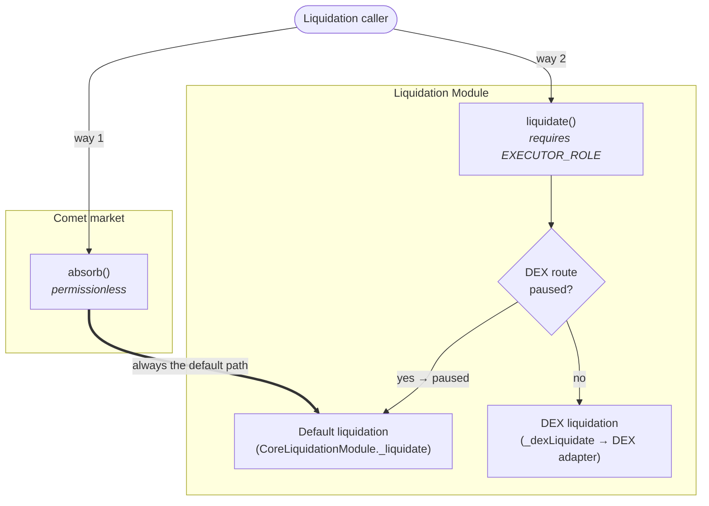

### The two ways in

A liquidation can be started through **two different functions**, and which one you call determines both who is allowed to call it and which route the liquidation takes.

| Entry point | Lives on | Who can call | Route it leads to |
|---|---|---|---|
| **`absorb()`** | Comet market | Anyone (permissionless) | Always the **default** liquidation logic |
| **`liquidate()`** | Liquidation Module | Only holders of `EXECUTOR_ROLE` | **DEX** liquidation, or **default** when the DEX route is paused |

**Way 1 — `Comet.absorb()` (permissionless).** This is the classic Comet path. Anyone can call it; the market accrues interest and then hands each account off to the Liquidation Module's `absorb()`, which runs the **default** liquidation logic in `CoreLiquidationModule`. This route **never** touches the DEX adapter — it is the plain, always-available way to wind down an account, open to any caller who wants the absorb incentive.

**Way 2 — `LiquidationModule.liquidate()` (executors only).** This is the newer, DEX-aware path, and it is gated by the `EXECUTOR_ROLE`. After accruing the account, it makes one routing decision based on a single switch, `dexRoutePaused`:

- **DEX route paused** → it falls back to the **same default logic** as way 1 (`_liquidate`). This is the safety valve: if the DEX path is turned off, executor liquidations keep working, just without the DEX.
- **DEX route active** → it proceeds to the **DEX liquidation** path (`_dexLiquidate`), which routes seized collateral through the **DEX adapter**.

### How the pieces map to contracts

The routing above is spread across three contracts, each with a clear responsibility:

- **Comet market** (`CometWithExtendedAssetList`) — owns `absorb()`, the permissionless entry point, and holds all balances. It calls into the module but never decides *how* to liquidate.
- **Liquidation Module** (`LiquidationModule`, extending `CoreLiquidationModule`) — owns `liquidate()`, the role-gated entry point, and holds the `dexRoutePaused` switch that chooses between the two routes. The **default** logic (`_liquidate`) it inherits from `CoreLiquidationModule`; the **DEX** logic (`_dexLiquidate`) it adds itself.
- **DEX adapter** — only ever reached from the DEX route. It is entirely absent from way 1 and from the paused branch of way 2.

Notice that **both routes converge on the same "default liquidation" box.** Whether you arrive via `absorb()` or via a paused `liquidate()`, you end up in the identical `CoreLiquidationModule._liquidate` logic. The DEX path is the *only* thing that is conditional — everything else routes to the same default core.

### Inside the Liquidation Module

The Liquidation Module is not one flat contract — it is assembled from several smaller ones, each owning a single concern. The scheme below puts the deployed `LiquidationModule` at the centre and shows what it is built from (solid arrows = *inherits*) and what it talks to at runtime (dashed arrows = *calls / uses*).

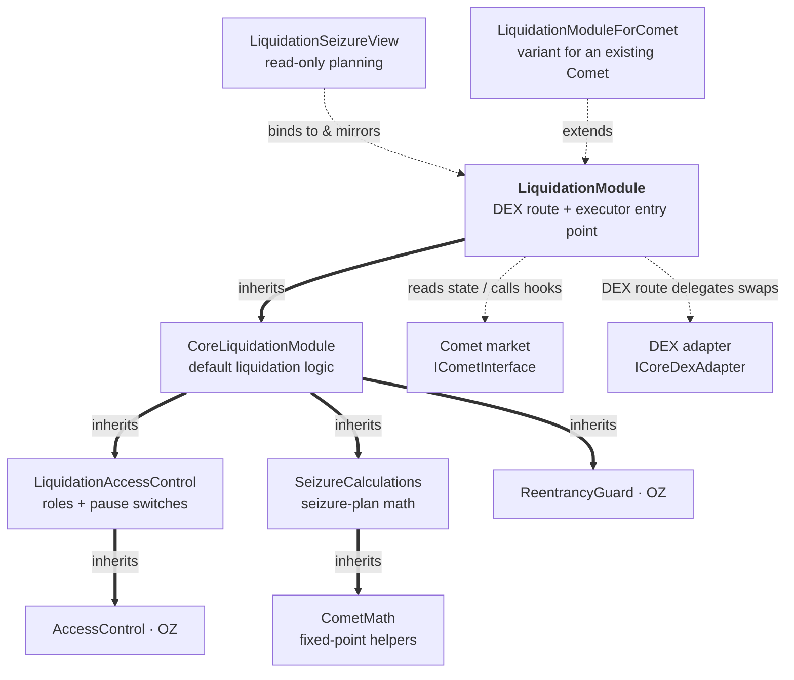

Which contract holds which logic:

- **`LiquidationModule`** — the deployed module. Adds the **DEX route** (`liquidate`, `_dexLiquidate`), holds the `dexAdapter` reference and the executor incentive. Everything below it is inherited.
- **`CoreLiquidationModule`** — the **default liquidation logic**: `absorb` (the Comet entry point), `_liquidate`, `isLiquidatable`, and the orchestration that turns a seizure plan into Comet hook calls.
- **`LiquidationAccessControl`** — the **roles and switches**: `EXECUTOR_ROLE`, `MULTISIG_ROLE`, `PAUSER_ROLE`, the `DAO`, plus the `dexRoutePaused` and `partialLiquidationEnabled` toggles.
- **`SeizureCalculations`** — the **seizure-plan math**: `_computeSeizurePlan`, `_getLiquidity` (the weighted-collateral sum from Chapter 2) and `getPrice`.
- **`CometMath`** — the shared **fixed-point helpers** (`mulPrice`, `mulFactor`, `divPrice`, …).
- **`ReentrancyGuard` / `AccessControl`** — standard OpenZeppelin building blocks.
- **`LiquidationSeizureView`** — a separate **read-only** contract bound to a module; it mirrors the seizure math with projected accrual (`seizurePlanAt`) for off-chain callers, and is not part of the module's own call path.
- **`LiquidationModuleForComet`** — a thin **variant** of `LiquidationModule` used when attaching to an already-deployed Comet.

### Inside the DEX adapter

The DEX adapter has the same shape: a small inheritance chain where the base contract orchestrates and each layer plugs in one swap route. The deployed adapter is `OneInchV6Adapter`; the layers beneath it are abstract.

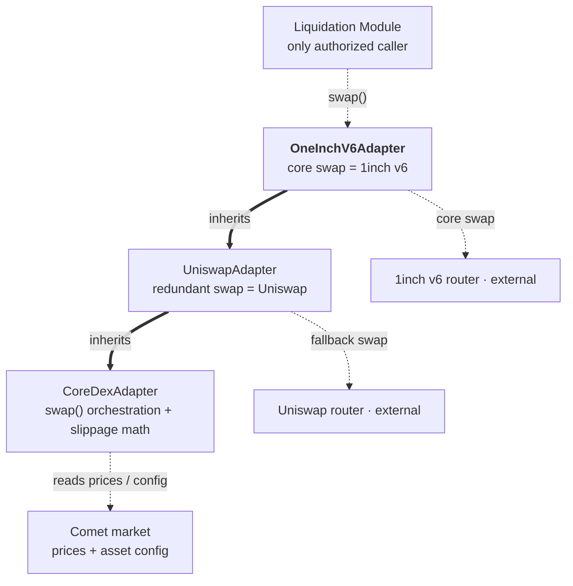

Which contract holds which logic:

- **`CoreDexAdapter`** — the **base orchestration**: the `swap()` entry point (core-then-redundant fallback), the minimum-output / slippage math (`calculateMinAmountOut`), router configuration, and the `onlyModule` binding. It declares the two swap routines as abstract.
- **`UniswapAdapter`** — implements the **redundant (fallback) route**, `_redundantSwap`, over a Uniswap router.
- **`OneInchV6Adapter`** — the **deployed adapter**; implements the **core (primary) route**, `_coreSwap`, over the 1inch v6 router. Being the concrete leaf, it carries both routes.
- **Liquidation Module** — the adapter's only permitted caller (`onlyModule`); it hands over seized collateral for each swap.
- **Comet market** — the adapter's source of **prices and asset config** used to size each swap's minimum output.

*How* the default liquidation computes a seizure plan, and *how* a swap actually executes and settles, are left to the chapters that follow — here we have only mapped the contracts and how a call is routed.

<div align="right"><a href="#table-of-contents">⬆ Back to Table of Contents</a></div>

---

## 5. Seizure Calculation

Both liquidation routes — the default absorb and the DEX path — begin at the **same** first step. Before either one moves a single token, it asks one question: **how much of which collateral should be seized, and how much debt does that clear?** The answer is a *seizure plan*, and it is produced by one function, `_computeSeizurePlan`. The DEX route later sells the planned collateral; the default route absorbs it into the protocol — but the plan itself is identical. This chapter is that plan.

### 5.1 What the plan works with

The function walks the account's collaterals one by one and, for each, decides how much to take. It keeps a few running values:

| Value | What it is |
|---|---|
| **`debtRemaining`** | The debt still left to cover, in USD (`1e8` price scale). Starts at the account's full debt value and shrinks as collateral is seized. |
| **`totalCollateralized`** | The account's collateral value weighted by **`borrowCollateralFactor`** (BCF) — its *borrowing power*. This is the number the target-health-factor math works on. |
| **`minDebt`** | `baseBorrowMin` valued in USD — the smallest borrow the market allows to exist. Residual debt is never left below this. |
| **`wantedCollateralValue`** (`S`) | For one asset: the **raw** USD value of collateral we want to seize (before any penalty). |
| **`seizedValue`** | How much **debt** that seizure clears = `S × liquidationFactor` (LF). Because `LF < 1`, clearing `$D` of debt requires seizing `$D / LF` of collateral — the difference is the liquidation penalty. |

> **Important distinction from [Chapter 2](#2-collateral-value-and-health-factor).** The *liquidatable* check uses the **LCF**-weighted value (`liquidateCollateralFactor`). Partial liquidation, here, aims to restore the **BCF**-weighted value (`borrowCollateralFactor`) — the borrower's *borrowing* health — up to `TARGET_HEALTH_FACTOR = 1.05`. That is a stricter, healthier target than merely crossing back above the liquidation line: after a partial liquidation the borrower is not just "not liquidatable", they can safely borrow again with a 5% margin.

At the end, whatever debt is left becomes the account's **new balance**, and `basePaidOut` records how much base the protocol effectively injected to reduce the debt.

### 5.2 The decision scheme

**Before the loop**, the function confirms the account is really liquidatable and gathers the running values it will need:

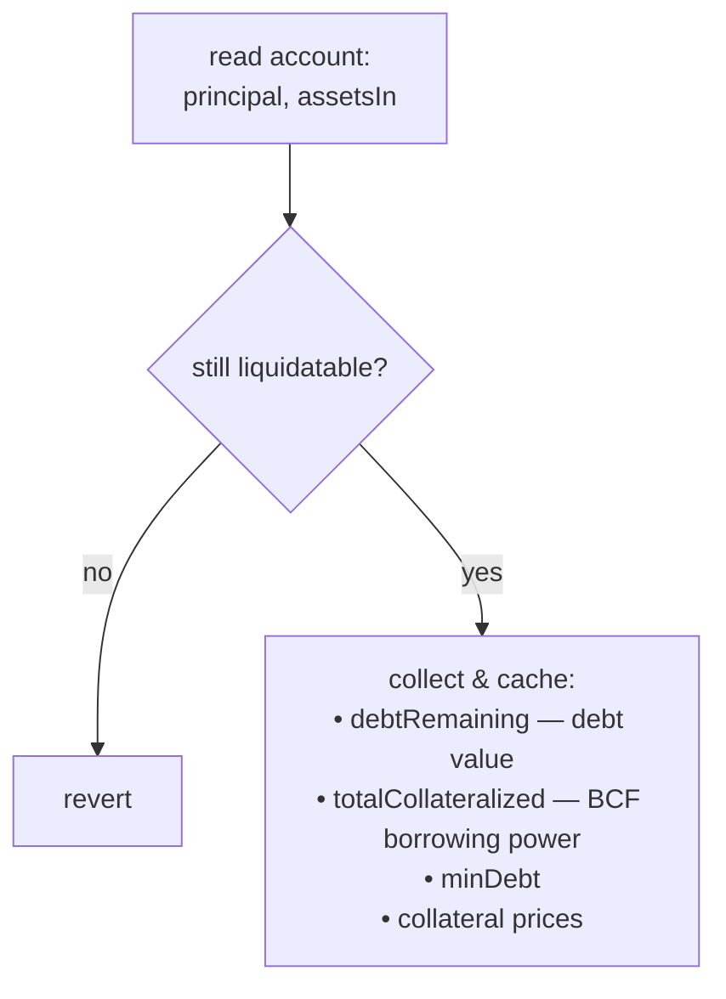

**Then it loops** over the account's collaterals in index order (skipping any with `liquidationFactor == 0`), taking one asset per pass from top to bottom:

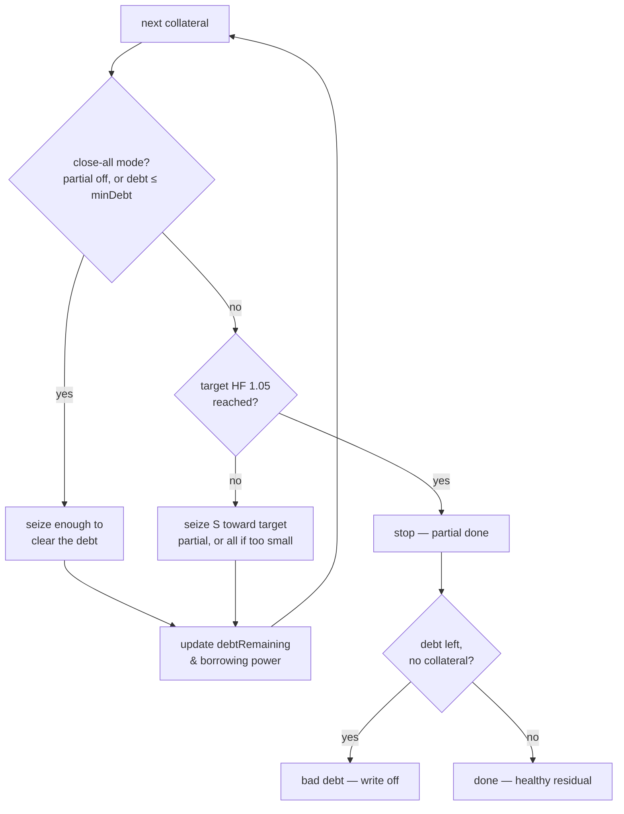

The four cases these two steps produce:

- **Full-close mode** — reached through the `Mode` branch when **partial liquidation is disabled**. Every asset goes straight to "close remaining debt": the account is fully liquidated until all debt is gone.
- **Partial liquidation** — the `Target` / `S` / `Partial` path. Seize only enough to lift borrowing health back to `1.05`, then stop, leaving the borrower with a smaller, healthy debt.
- **Min-debt** — reached through the same `Mode` branch when `debtRemaining ≤ minDebt`, or through the `MinGuard` after a partial step. Rather than leave a dust debt below `baseBorrowMin`, the module closes the **whole** remaining debt.
- **Bad debt** — the `Post` check: all collateral is gone (`totalCollateralized == 0`) but debt remains. The shortfall is written off — the protocol takes the loss.

### 5.3 The wanted-collateral-value formula

The heart of partial liquidation is deciding how much collateral value `S` to seize from an asset so that, afterwards, the account sits exactly at the target health factor. Start from what one seizure does:

- seizing raw collateral value `S` reduces **borrowing power** by `S × BCF` (that collateral leaves the account),
- and reduces **debt** by `S × LF` (that is the `seizedValue`).

So the health factor *after* seizing `S` is:

```ts
// targetHF is what we solve for S to achieve (= 1.05)
targetHF = (totalCollateralized − S × BCF) / (debtRemaining − S × LF)
```

Solving that for `S` gives the formula the contract uses:

```ts
//        targetHF · debtRemaining − totalCollateralized
//  S  =  ───────────────────────────────────────────────
//              targetHF · LF − BCF
S = (TARGET_HEALTH_FACTOR * debtRemaining - totalCollateralized)
  / (TARGET_HEALTH_FACTOR * liquidationFactor - borrowCollateralFactor);

// Never seize more than what clears the whole debt: S · LF ≤ debtRemaining.
const maxWanted = debtRemaining / liquidationFactor;
if (S > maxWanted) S = maxWanted;
```

A word on **why the denominator is always positive** (so `S` is well-defined and positive): the Configurator enforces `LF > LCF > BCF`, and `targetHF ≥ 1`, therefore `targetHF · LF ≥ LF > BCF`. The denominator can never be zero or negative.

Once `S` is known, the per-asset outcome is:

```ts
seizedAmount = S / price;   // collateral units to take
seizedValue  = S * LF;      // debt cleared by this seizure
```

**Worked example (one collateral).** Same market shape as Chapter 2:

| Parameter | Value |
|---|---|
| Base | USDC, `$1.00`, `baseBorrowMin = 1,000` |
| WETH price | `$2,000` |
| WETH `borrowCollateralFactor` (BCF) | `0.80` |
| WETH `liquidateCollateralFactor` (LCF) | `0.85` |
| WETH `liquidationFactor` (LF) | `0.90` |

The borrower holds **10 WETH** (`$20,000`) and owes **$17,200**.

```
Is it liquidatable?
  LCF-weighted collateral = $20,000 × 0.85 = $17,000
  debt $17,200 > $17,000  →  yes, liquidatable

Borrowing power (the target-HF base):
  totalCollateralized = $20,000 × 0.80 = $16,000

How much to seize (S):
  S = (1.05 × 17,200 − 16,000) / (1.05 × 0.90 − 0.80)
    = (18,060 − 16,000) / (0.945 − 0.80)
    = 2,060 / 0.145
    ≈ $14,207                         (cap = 17,200 / 0.90 = $19,111 → not hit)

  S ($14,207) < holding value ($20,000)  →  partial seize
  seizedAmount = 14,207 / 2,000 ≈ 7.10 WETH
  seizedValue  = 14,207 × 0.90  ≈ $12,786   (debt cleared)

After:
  debt            = 17,200 − 12,786 ≈ $4,414   (> $1,000 min, so it stays)
  borrowing power = 16,000 − 14,207 × 0.80 ≈ $4,635
  new BCF health  = 4,635 / 4,414 ≈ 1.05       ✓ target restored
```

The borrower is left holding **≈ 2.90 WETH** and owing **≈ $4,414** — a healthy position again, rather than being fully wiped out.

### 5.4 The four cases, one example each

All examples reuse the WETH market above (`$2,000`, BCF `0.80`, LCF `0.85`, LF `0.90`, `baseBorrowMin = $1,000`).

**Full-close mode (partial disabled).** With `partialLiquidationEnabled == false`, health factors are ignored — every account is taken all the way to zero debt.

```
Holding 10 WETH ($20,000), debt $9,000, partial DISABLED.
  → close the whole $9,000:
    seize = (9,000 / 0.90) / 2,000 = 5 WETH   (raw value $10,000)
    debt cleared = $9,000  →  debt $0
  Borrower keeps 5 WETH, owes nothing.
  ($10,000 of collateral cleared $9,000 of debt — the $1,000 gap is the penalty.)
```

**Partial liquidation.** The `$17,200` example in [§5.3](#53-the-wanted-collateral-value-formula): seize ≈ 7.10 WETH to restore borrowing health to `1.05`, leaving the borrower with ≈ 2.90 WETH and ≈ $4,414 of debt.

**Min-debt.** Residual debt is never left below `baseBorrowMin`. If a partial step *would* leave dust, the module closes the whole debt instead.

```
Holding 1 WETH ($2,000), debt $1,750  (LCF threshold $1,700 → liquidatable).
  Partial would seize S ≈ $1,638 → clear ≈ $1,474 → leave ≈ $276 of debt.
  But $276 ≤ minDebt $1,000  →  min-debt guard fires.
  → close the whole $1,750 instead:
    seize = (1,750 / 0.90) / 2,000 ≈ 0.972 WETH
    debt  →  $0
  Borrower keeps ≈ 0.028 WETH, owes nothing.
```

**Bad debt.** When even seizing *everything* cannot cover the debt, the leftover is written off as a protocol loss.

```
Holding 1 WETH ($2,000), debt $2,500  (LCF threshold $1,700 → liquidatable).
  Most debt 1 WETH can clear = $2,000 × 0.90 = $1,800  <  $2,500.
  → seize all 1 WETH, clear $1,800, $700 of debt remains.
    No collateral left (totalCollateralized = 0)  →  bad debt.
  The $700 shortfall is written off; the borrower's balance is set to 0.
  Borrower keeps nothing, owes nothing; the protocol absorbs the $700 loss.
```

### 5.5 Multiple collaterals: a three-asset walkthrough

With several collaterals the function loops in index order, seizing each asset in turn until the target is reached. This example shows all three loop behaviours in one pass — *seize all*, *seize partial*, and *stop*.

| Asset | Holding | Value | BCF | LCF | LF |
|---|---|---|---|---|---|
| WBTC | 0.2 | `$6,000` | 0.70 | 0.75 | 0.90 |
| WETH | 3 | `$6,000` | 0.80 | 0.85 | 0.90 |
| LINK | 400 | `$4,000` | 0.65 | 0.70 | 0.85 |

```
Setup:
  LCF-weighted   = 6,000·0.75 + 6,000·0.85 + 4,000·0.70 = $12,400  (liquidation threshold)
  totalCollat.   = 6,000·0.70 + 6,000·0.80 + 4,000·0.65 = $11,600  (borrowing power)
  debt $13,000 > $12,400  →  liquidatable.   minDebt = $1,000

Asset 0 — WBTC:
  target reached? 1.05·13,000 = 13,650 ≤ 11,600 ?  no
  S = (13,650 − 11,600) / (1.05·0.90 − 0.70) = 2,050 / 0.245 ≈ $8,367
  S ($8,367) < WBTC value ($6,000) ?  no  →  seize ALL 0.2 WBTC
    seizedValue = 6,000 · 0.90 = $5,400
  debtRemaining  = 13,000 − 5,400 = $7,600
  totalCollat.   = 11,600 − 6,000·0.70 = $7,400

Asset 1 — WETH:
  target reached? 1.05·7,600 = 7,980 ≤ 7,400 ?  no
  S = (7,980 − 7,400) / (1.05·0.90 − 0.80) = 580 / 0.145 = $4,000
  S ($4,000) < WETH value ($6,000) ?  yes  →  seize PARTIAL
    seizedAmount = 4,000 / 2,000 = 2 WETH
    seizedValue  = 4,000 · 0.90 = $3,600
    residual 7,600 − 3,600 = 4,000  >  minDebt $1,000  →  no min-debt switch
  debtRemaining  = $4,000
  totalCollat.   = 7,400 − 4,000·0.80 = $4,200

Asset 2 — LINK:
  target reached? 1.05·4,000 = 4,200 ≤ 4,200 ?  yes  →  STOP
```

**Result:** the plan seizes **all 0.2 WBTC** and **2 of the 3 WETH**, and never touches LINK. The debt drops from `$13,000` to `$4,000`, and borrowing health is restored to exactly `4,200 / 4,000 = 1.05`. The borrower keeps **1 WETH + 400 LINK** and owes **$4,000** — healthy again.

### 5.6 Summary

- Both routes share one first step: `_computeSeizurePlan` decides **which collateral to seize and how much debt it clears**, before any settlement happens.
- It tracks `debtRemaining`, `totalCollateralized` (BCF-weighted **borrowing power**), and `minDebt`, walking the account's collaterals in order.
- Partial liquidation restores **borrowing** health to `TARGET_HEALTH_FACTOR = 1.05` — stricter than just clearing the liquidation line — using `S = (targetHF·debt − totalCollateralized) / (targetHF·LF − BCF)`, capped at `debt / LF`.
- Four outcomes: **full-close** (partial disabled), **partial** (reach `1.05` and stop), **min-debt** (never leave dust below `baseBorrowMin` — close it all), and **bad debt** (collateral exhausted — write off the shortfall).
- Seizing `$S` of collateral clears `$S × LF` of debt; the `1/LF − 1` gap is the liquidation penalty.

<div align="right"><a href="#table-of-contents">⬆ Back to Table of Contents</a></div>

---

## 6. Default Liquidation

The seizure plan from [Chapter 5](#5-seizure-calculation) only *decides* what to take — it doesn't move anything yet. **Default liquidation** is the settlement step that writes that plan into the market's storage: it reduces the borrower's collateral, reduces the borrower's debt, and records both. This is the route reached by the permissionless `absorb()` and by an executor's `liquidate()` when the DEX path is paused ([Chapter 4](#4-structure-of-the-protocol)).

It is deliberately simple. The plan already contains every number; the module just applies them, one collateral at a time, and then settles the debt once.

### 6.1 The two writes

Default settlement lives in `CoreLiquidationModule._liquidate`. After getting the plan, it does exactly two kinds of write — a **collateral** write per seized asset, then a **single debt** write:

```ts
function _liquidate(absorber: string, account: string) {
  // From Chapter 5: per-asset seizures + the account's resulting debt.
  const { plan, newBalance, basePaidOut, basePaidOutValue } = computeSeizurePlan(account);

  // 1 — apply each collateral seizure through the Comet hook.
  for (const s of plan) {
    if (s.seizedAmount === 0n) continue;
    comet.updateCollateral(absorber, account, s.index, s.seizedAmount, s.wantedCollateralValue);
  }

  // 2 — apply the new debt / principal once, at the end.
  comet.updateDebtAndPrincipal(absorber, account, newBalance, basePaidOut, basePaidOutValue);
}
```

Both calls are **hooks on the Comet market** — the module computes, but only Comet touches balances. And both emit their events (`AbsorbCollateral`, `AbsorbDebt`) **from Comet itself**, so anyone watching the market sees every seizure and every debt change on one address, regardless of which liquidation route produced it.

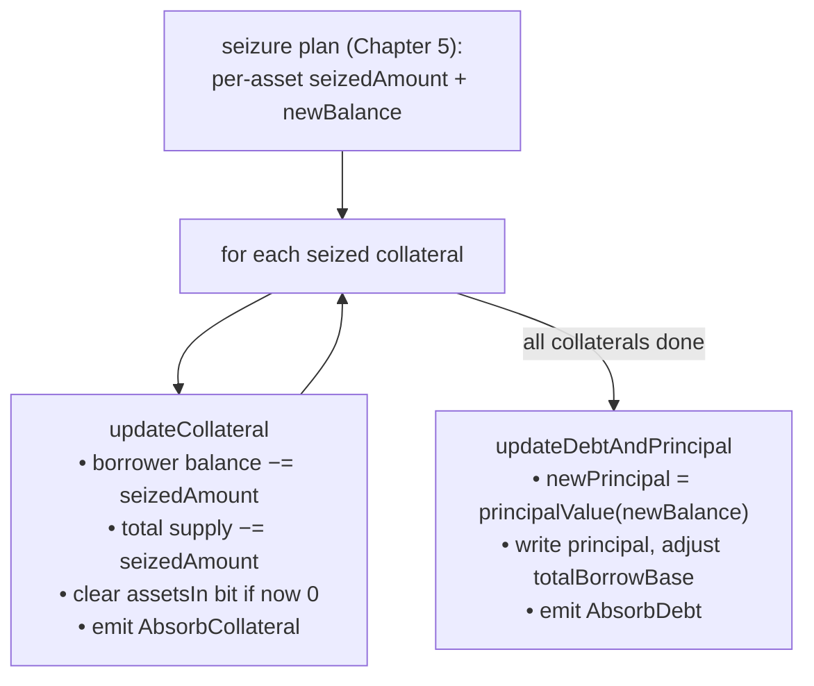

### 6.2 Updating each collateral

For every asset in the plan, `updateCollateral` moves the seized amount **out of the borrower and into the protocol**:

```ts
// Comet._updateCollateral
userCollateral[account][asset].balance      -= seizedAmount;  // borrower holds less
totalsCollateral[asset].totalSupplyAsset    -= seizedAmount;  // market tracks less user supply
updateAssetsIn(account, asset, before, before - seizedAmount); // drop the assetsIn flag if it hit 0
emit AbsorbCollateral(absorber, account, asset, seizedAmount, usdValue);
```

Three things happen, and one thing deliberately does **not**:

- The borrower's balance of that collateral drops by `seizedAmount`.
- The market's `totalSupplyAsset` for that collateral drops by the same amount — the seized tokens are no longer counted as *user* supply. They stay inside the Comet contract as **protocol-owned collateral** (protocol reserves), later resold to the public via `buyCollateral`.
- If the seizure empties the borrower's balance of that asset, its `assetsIn` bit is cleared so the account stops being scanned for it.
- **No token transfer leaves Comet.** This is the one real difference from the DEX route: default liquidation absorbs the collateral into the protocol rather than sending it out to be swapped. (The DEX route uses `updateAndSeizeCollateral`, which does transfer the collateral out — covered in a later chapter.)

The `usdValue` passed here is the plan's `wantedCollateralValue` — the raw USD value of the seized collateral — and it is only used for the event, not for any balance math.

### 6.3 Updating debt and principal

After every collateral is written, a single `updateDebtAndPrincipal` settles the borrower's base position to the plan's `newBalance` (the residual debt — negative, or `0` when fully closed or written off):

```ts
// Comet.updateDebtAndPrincipal
const oldPrincipal = userBasic[account].principal;
const newPrincipal = principalValue(newBalance);   // present value → stored principal

updateBasePrincipal(account, accountUser, newPrincipal); // write the new principal
totalBorrowBase -= newPrincipal - oldPrincipal;          // shrink the global borrow total
emit AbsorbDebt(absorber, account, basePaidOut, basePaidOutValue);
```

The one piece of math worth pausing on is `principalValue(newBalance)`. Chapter 3 turned stored *principal* into a present-value balance by **multiplying** by the borrow index. This is the exact inverse: it turns the target present-value balance back into a stored *principal* by **dividing out** the current borrow index, so that interest keeps accruing correctly on the reduced debt going forward.

```ts
// inverse of the presentValue() step from Chapter 3
newPrincipal ≈ newBalance × BASE_INDEX_SCALE / baseBorrowIndex
```

Because the debt shrank, `newPrincipal` is closer to zero than `oldPrincipal`, so `newPrincipal − oldPrincipal` is positive and `totalBorrowBase` decreases by exactly the amount of borrow removed. `basePaidOut` — the base value the protocol effectively injected to clear that debt — is reported in the `AbsorbDebt` event but is not itself a balance write here.

### 6.4 A worked example

Take the single-collateral partial from [§5.3](#53-the-wanted-collateral-value-formula): the borrower held **10 WETH** and owed **$17,200**; the plan seized **≈ 7.10 WETH** and left a residual debt of **≈ $4,414**. Default settlement writes that as:

```
updateCollateral (WETH):
  borrower WETH balance   10  →  ≈ 2.90
  WETH totalSupplyAsset       −≈ 7.10        (those 7.10 WETH now protocol-owned)
  assetsIn WETH bit           unchanged      (balance still > 0)
  emit AbsorbCollateral(... seized ≈ 7.10 WETH, usdValue ≈ $14,207)

updateDebtAndPrincipal:
  newBalance      ≈ −$4,414   →  newPrincipal (present value ÷ borrow index)
  totalBorrowBase −= (newPrincipal − oldPrincipal)   (global borrow shrinks by ≈ $12,786)
  emit AbsorbDebt(... basePaidOut ≈ $12,786)
```

The borrower walks away holding ≈ 2.90 WETH and owing ≈ $4,414 — a healthy position — and the protocol now holds the seized 7.10 WETH in reserves, having cleared ≈ $12,786 of the debt.

### 6.5 Summary

- Default liquidation is pure **settlement**: it applies the Chapter 5 plan and moves no decision logic of its own.
- It performs **one `updateCollateral` per seized asset** (reduce borrower balance + total supply, clear the `assetsIn` bit if emptied) and **one `updateDebtAndPrincipal`** at the end.
- Seized collateral **stays in the protocol** (no transfer out) — the defining contrast with the DEX route.
- `principalValue(newBalance)` converts the target balance back to stored principal by **dividing out the borrow index** — the inverse of Chapter 3's `presentValue`.
- Both writes emit their events (`AbsorbCollateral`, `AbsorbDebt`) **from Comet**, so every liquidation is observable on the market address no matter which route ran.

<div align="right"><a href="#table-of-contents">⬆ Back to Table of Contents</a></div>

---

## 7. DEX Liquidation

Default liquidation ([Chapter 6](#6-default-liquidation)) parks the seized collateral in the protocol and lets the protocol's reserves cover the debt. **DEX liquidation** does something more self-contained: in the *same transaction* it **sells** the seized collateral for the base asset, uses the proceeds to cover the debt, and pays the executor a cut of whatever is left over. Nothing has to sit in reserves waiting to be resold.

This is the executor-only route from [Chapter 4](#4-structure-of-the-protocol) (`liquidate()`, `EXECUTOR_ROLE`, only when the DEX path isn't paused). The seizure plan is the *same* one from [Chapter 5](#5-seizure-calculation) — what changes is the settlement: collateral is swapped, not absorbed. The selling is delegated to the **DEX adapter**, which tries **1inch first** and falls back to **Uniswap**, and if both fail, sweeps the collateral back to Comet to be absorbed instead.

### 7.1 What the module does

`LiquidationModule._dexLiquidate` orchestrates the whole thing. It walks the plan, and for each collateral it seizes the tokens, forwards them to the adapter, and asks the adapter to swap. Once every collateral is handled, it closes the debt and settles the base.

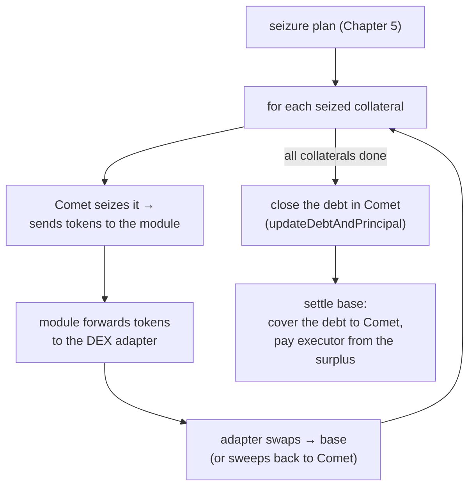

In code, the per-collateral loop:

```ts
const baseBefore = baseToken.balanceOf(module);
let unswappedSeizedValue = 0n;

for (let i = 0; i < plan.length; i++) {
  const s = plan[i];
  if (s.seizedAmount === 0n) continue;

  // Comet reduces the borrower's balance, emits AbsorbCollateral, and (unlike the default
  // route) transfers the seized tokens out to the module.
  comet.updateAndSeizeCollateral(absorber, account, s.index, s.seizedAmount, s.wantedCollateralValue);

  // Module hands the tokens to the adapter and asks it to swap them into base.
  transfer(s.asset, dexAdapter, s.seizedAmount);

  // false = the swap failed and the adapter swept this collateral back to Comet, so its value
  // was covered in-kind and must NOT be expected back as base.
  if (!dexAdapter.swap(s.asset, s.seizedAmount, swapData[i])) {
    unswappedSeizedValue += s.seizedValue;
  }
}

// Debt is closed regardless — the adapter already enforced slippage on every swap.
comet.updateDebtAndPrincipal(absorber, account, newBalance, basePaidOut, basePaidOutValue);
```

The executor supplies one `swapData` entry per planned collateral (the off-chain 1inch calldata), aligned to the plan's order — hence the `swapData.length === plan.length` check. The single real difference from the default route is `updateAndSeizeCollateral` instead of `updateCollateral`: it **transfers the collateral out** to the module so it can be sold, rather than leaving it in the protocol.

### 7.2 How the adapter swaps: 1inch → Uniswap → sweep

Each `dexAdapter.swap(...)` call tries up to two venues and has a guaranteed fallback, so a single failing swap never blocks the whole liquidation.

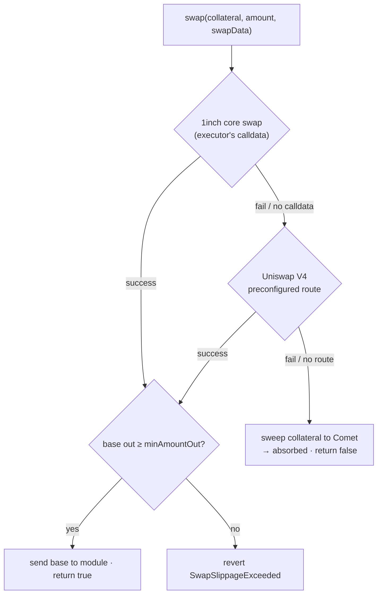

Step by step:

1. **Minimum output.** First the adapter prices the swap from the oracle and applies the slippage tolerance: `minAmountOut = oracle value of the collateral in base × (1 − slippageBps)`. A per-collateral slippage override is used when set, otherwise the global one.
2. **1inch (core).** If the executor supplied calldata, the adapter validates it against the request — source/destination tokens, receiver is the adapter, exact `amountIn`, and `minReturnAmount ≥ minAmountOut` — then calls the 1inch V6 router. If the call reverts, the leftover allowance is cleared so the fallback starts clean.
3. **Uniswap (redundant).** If the core swap didn't succeed (it failed, or no calldata was given), the adapter falls back to its **preconfigured Uniswap V4 route** for that collateral. If there is no route, or the router call reverts, the adapter **sweeps the collateral to Comet** and returns `false`.
4. **Final slippage guard.** On a successful swap the adapter re-checks the base actually received against `minAmountOut` and reverts `SwapSlippageExceeded` if short; otherwise it sends the base to the module and returns `true`.

The important property: a `false` return is *not* an error — it means "this collateral couldn't be sold, so I gave it back to Comet to absorb." The module handles that case in its settlement, which is next.

### 7.3 Settling the base

After the loop the module holds however much base the swaps produced. It has to (a) give Comet enough base to back the debt it just closed, (b) not expect base for any collateral that was swept back, and (c) pay the executor for the service — but only out of genuine surplus.

```ts
const baseReceived = baseToken.balanceOf(module) - baseBefore;

// Collateral that was swept back to Comet already covered its share in-kind, so subtract its
// base-equivalent from what the module must hand over.
const unswappedBaseAmount = divPrice(unswappedSeizedValue, basePrice, baseScale);
const baseRequired = basePaidOut > unswappedBaseAmount ? basePaidOut - unswappedBaseAmount : 0n;

let incentive = 0n;
let baseForComet;

if (baseReceived + BASE_ROUNDING_DUST < baseRequired) {
  // Even the sale proceeds fall short of the debt → bad debt. No incentive; Comet gets it all.
  baseForComet = baseReceived;
  emit BadDebtLiquidate(absorber, account, executor, baseReceived);
} else {
  // Normal case: the executor earns incentiveBps of the surplus above what the debt needed.
  const surplus = baseReceived > baseRequired ? baseReceived - baseRequired : 0n;
  incentive = surplus * incentiveBps / BPS;
  baseForComet = baseReceived - incentive;
}

if (baseForComet > 0n) transfer(baseToken, comet, baseForComet);
if (incentive   > 0n) transfer(baseToken, executor, incentive);
```

The pieces:

- **`baseRequired`** is the base the module must actually deliver: the debt it closed (`basePaidOut`) minus the value of any swept-back collateral (which Comet already got in-kind). The `BASE_ROUNDING_DUST` (1 wei) tolerance absorbs a rounding mismatch — `basePaidOut` rounds up while `unswappedBaseAmount` rounds down — so a debt covered right down to the wei isn't misreported as bad debt.
- **Incentive** is taken *only from the surplus* — the base left after the debt is covered — never from the debt itself, and it's capped at `MAX_INCENTIVE = 10%`. Everything except the incentive goes to Comet (covering the debt and adding the rest to reserves).
- **Bad debt** is when even the sale proceeds can't cover `baseRequired`: no incentive is paid, all proceeds go to Comet, and `BadDebtLiquidate` is emitted.

**Worked example (normal case).** Reuse the §5.3 plan: the seizure cleared **≈ $12,786** of debt by taking **≈ 7.10 WETH** (raw value ≈ $14,207). Every collateral swapped (nothing swept), and the sale of that WETH returns, after slippage/fees, **≈ $13,800** of base. With `incentiveBps = 5%`:

```
baseRequired = basePaidOut − unswappedBaseAmount = 12,786 − 0 = $12,786
baseReceived = $13,800   (≥ baseRequired, so not bad debt)
surplus      = 13,800 − 12,786 = $1,014
incentive    = 1,014 × 5% ≈ $51            → to the executor
baseForComet = 13,800 − 51 ≈ $13,749       → to Comet (covers the $12,786 debt, ~$963 to reserves)
```

**Worked example (bad debt).** If instead the sale returned only **$1,800** against a `baseRequired` of **$2,500**:

```
baseReceived $1,800  +  dust  <  baseRequired $2,500   →  bad debt
incentive    = 0
baseForComet = $1,800   → all to Comet
emit BadDebtLiquidate(... $1,800)
```

### 7.4 Summary

- DEX liquidation runs the **same seizure plan** as default, but **sells** the collateral for base in-transaction instead of absorbing it — via `updateAndSeizeCollateral`, which transfers the tokens out to the module.
- The module loops **seize → forward to adapter → swap**, then closes the debt once and settles the base.
- The adapter tries **1inch (core, executor calldata) → Uniswap V4 (redundant, preconfigured route) → sweep to Comet**. A swept collateral returns `false` and is simply absorbed instead of sold — never a hard failure.
- Every swap is bounded by an **oracle-derived `minAmountOut`** (slippage tolerance), enforced by both the router and a final adapter check.
- Settlement pays Comet **`baseRequired`** (closed debt minus in-kind swept value) and pays the executor **`incentiveBps` of the surplus only** (max 10%). If proceeds fall short, it's **bad debt**: no incentive, all proceeds to Comet, `BadDebtLiquidate` emitted.

<div align="right"><a href="#table-of-contents">⬆ Back to Table of Contents</a></div>

---

## 8. Benefits for Liquidators

Liquidation is not charity — it only happens because it is **profitable** for whoever performs it. The protocol pays that profit out of the liquidation penalty (the `1/LF − 1` gap from [Chapter 5](#5-seizure-calculation)): the borrower's collateral is valued at a discount, and that discount is the liquidator's income. The two routes pay it out in two different ways.

| Route | Who earns | How they earn | Capital needed |
|---|---|---|---|
| **DEX** (`liquidate`) | Executor (keeper) | A cut of the swap **surplus**, in base, atomically | None — collateral is sold in the same tx |
| **Default** (`absorb` + `buyCollateral`) | Anyone | The **discount** on collateral bought from the protocol | Base to buy the collateral |

### 8.1 DEX route: a cut of the surplus

This is the most direct income. As shown in [§7.3](#73-settling-the-base), after the executor's swaps cover the debt, the base left over is **surplus**, and the executor keeps a configured fraction of it:

```ts
surplus   = baseReceived - baseRequired;          // base left after the debt is covered
incentive = surplus * incentiveBps / BPS;         // the executor's income (BPS = 10_000)
```

Two properties make this attractive:

- **It is atomic and capital-free.** The collateral is seized and sold inside the same transaction, so the executor never has to front any money — they only need to supply good swap calldata and pay gas.
- **It is bounded.** `incentiveBps` is set by governance and capped at `MAX_INCENTIVE = 1_000` (10%). It is taken **only from the surplus**, never from the debt, so paying the executor can never create bad debt.

**Example.** From the §7.3 walkthrough: the swaps returned `$13,800` of base against a `baseRequired` of `$12,786`, with `incentiveBps = 5%`:

```
surplus   = 13,800 − 12,786 = $1,014
incentive = 1,014 × 5%      ≈ $51        → paid to the executor in base, same transaction
```

The executor walks away with ≈ $51 for the service, and the remaining surplus (≈ $963) is added to Comet's reserves. If the sale had fallen short of `baseRequired`, it would be bad debt — the executor earns nothing, but also loses nothing beyond gas.

### 8.2 Default route: buying collateral at a discount

The permissionless route splits the profit into two public steps. First, **`absorb()`** moves the underwater account's collateral into the protocol's reserves (Chapter 6) — the caller earns *liquidator points*, not tokens (more on those below). Then, separately, **anyone** can buy that collateral back from the protocol at a **discount to market** via `buyCollateral`. That discount is the real income.

The discount is derived from the collateral's `liquidationFactor` and the market's `storeFrontPriceFactor`:

```ts
// A lower liquidationFactor (riskier collateral) → a larger discount.
// storeFrontPriceFactor (0..1) controls how much of that gap is passed to buyers.
discountFactor  = storeFrontPriceFactor * (1e18 - liquidationFactor);
discountedPrice = marketPrice * (1e18 - discountFactor);

// Collateral received for a given base spend, at the discounted price:
collateralAmount = basePrice * baseAmount * assetScale / discountedPrice / baseScale;
```

Because the buyer pays `discountedPrice` but receives collateral worth `marketPrice`, the gap is instant profit (before gas and their own resale slippage).

**Example.** WETH at a market price of `$2,000`, `liquidationFactor = 0.90`, `storeFrontPriceFactor = 0.5`:

```
discountFactor  = 0.5 × (1 − 0.90) = 0.05          (a 5% discount)
discountedPrice = 2,000 × (1 − 0.05) = $1,900 per WETH

Spend $19,000 of base:
  collateralAmount = 19,000 / 1,900 = 10 WETH   (worth $20,000 at market)
  profit           = 20,000 − 19,000 = $1,000   (5.3% on base spent)
```

Two conditions gate this: `buyCollateral` only sells while the protocol's reserves are **below `targetReserves`** (it sells collateral to rebuild base), and riskier assets (lower `liquidationFactor`) carry a **bigger discount** — the protocol pays more to offload what is harder to sell.

**Liquidator points.** The `absorb()` caller also accrues on-chain `liquidatorPoints` — `numAbsorbs`, `numAbsorbed`, and `approxSpend` (a gas-cost estimate). These are *not* direct income; the code itself notes they are "an imperfect tool for governance" — a record governance can use to reward absorbers. The dependable profit in this route is the `buyCollateral` discount, and in practice one bot does both steps: absorb the account, then buy its collateral.

### 8.3 Summary

- Both routes pay the liquidator out of the **liquidation penalty** — the discount at which the borrower's collateral is valued.
- **DEX route:** the executor earns `incentive = surplus × incentiveBps / BPS`, in base, **atomically and capital-free**, taken only from surplus and capped at 10%. Bad debt pays nothing (but costs nothing beyond gas).
- **Default route:** profit comes from `buyCollateral` at `discountedPrice = marketPrice × (1 − storeFrontPriceFactor × (1 − liquidationFactor))` — bigger discount for riskier collateral — and requires base capital and an available reserves shortfall. The `absorb()` caller separately earns governance-facing liquidator points.
- Either way, the incentive is designed so the liquidator's gain **cannot** come at the expense of the debt being covered — it is only ever paid from surplus or from a discount the protocol chooses to offer.

<div align="right"><a href="#table-of-contents">⬆ Back to Table of Contents</a></div>

---

## 9. Events

Every liquidation leaves a complete on-chain trail. If you index the market you can reconstruct exactly what was seized, how much debt was cleared, what a swap returned, and what the executor earned — all from events. This chapter lists each one, **where it is emitted**, **what it carries**, and **how those values were computed** (with pointers back to the chapter that derived them).

A deliberate design point: the two core liquidation events, `AbsorbCollateral` and `AbsorbDebt`, are emitted by **Comet itself** for *both* routes ([Chapter 6](#6-default-liquidation)). Whoever watches the market sees every seizure on one address, no matter whether it came through `absorb()` or `liquidate()`.

### 9.1 Liquidation lifecycle events

| Event | Emitted by | Route(s) | Fires |
|---|---|---|---|
| `AbsorbCollateral` | Comet | both | once per seized collateral |
| `AbsorbDebt` | Comet | both | once per liquidation |
| `Swap` | DEX adapter | DEX | once per successful swap |
| `RedundantSwapFailed` | DEX adapter | DEX | when a collateral can't be sold and is swept to Comet |
| `DexLiquidate` | Liquidation Module | DEX | once, at the end of a DEX liquidation |
| `BadDebtLiquidate` | Liquidation Module | DEX | additionally, when swap proceeds can't cover the debt |
| `BuyCollateral` | Comet | default (after) | when someone buys absorbed collateral |

**`AbsorbCollateral(address indexed absorber, address indexed borrower, address indexed asset, uint collateralAbsorbed, uint usdValue)`**
- `collateralAbsorbed` — the seized amount in the token's own units = the plan's `seizedAmount` ([Chapter 5](#5-seizure-calculation)).
- `usdValue` — the raw USD value of that collateral = the plan's `wantedCollateralValue` (`1e8` price scale). Used only for reporting, not for any balance math.

**`AbsorbDebt(address indexed absorber, address indexed borrower, uint basePaidOut, uint usdValue)`**
- `basePaidOut` — base-asset units of debt cleared = `newBalance − oldBalance` ([Chapters 5–6](#6-default-liquidation)).
- `usdValue` — that amount valued in USD = `basePaidOut × basePrice / baseScale` (the plan's `basePaidOutValue`).

**`Swap(address collateral, uint amountIn, uint amountOut)`**
- `amountIn` — the collateral sold = the seizure's `seizedAmount`.
- `amountOut` — base actually received from the venue, guaranteed `≥ minAmountOut` (the oracle-derived slippage floor from [§7.2](#72-how-the-adapter-swaps-1inch--uniswap--sweep)).

**`RedundantSwapFailed(address collateral, uint amountIn)`** — emitted when neither 1inch nor Uniswap could sell `amountIn` of `collateral`, so it was swept back to Comet to be absorbed instead. In the settlement its value is subtracted from `baseRequired` ([§7.3](#73-settling-the-base)).

**`DexLiquidate(address indexed absorber, address indexed account, address indexed executor, uint baseReceived, uint baseRepaid, uint incentive)`**
- `baseReceived` — total base realized from all swaps = `moduleBaseBalanceAfter − baseBefore`.
- `baseRepaid` — base sent to Comet = `baseReceived − incentive` (covers the debt, with any remainder going to reserves).
- `incentive` — the executor's cut = `surplus × incentiveBps / BPS` ([Chapters 7–8](#8-benefits-for-liquidators)).

**`BadDebtLiquidate(address indexed absorber, address indexed account, address indexed executor, uint baseReceived)`** — emitted *in addition to* `DexLiquidate` when `baseReceived + dust < baseRequired`. `incentive` is `0`, and all `baseReceived` goes to Comet.

**`BuyCollateral(address indexed buyer, address indexed asset, uint baseAmount, uint collateralAmount)`** — the follow-up to a default absorb: `baseAmount` of base paid in, `collateralAmount` received at the discounted quote (`quoteCollateral`, [Chapter 8](#8-benefits-for-liquidators)).

### 9.2 The order events fire

**Default route (`absorb`):**

```
per seized collateral:  AbsorbCollateral
once at the end:        AbsorbDebt
(later, a separate tx:) BuyCollateral   — when a liquidator buys the absorbed collateral
```

**DEX route (`liquidate`):**

```
per seized collateral:  AbsorbCollateral         (Comet seizes + transfers out)
                        Swap            OR RedundantSwapFailed
once at the end:        AbsorbDebt               (debt closed)
                        BadDebtLiquidate         (only if proceeds fell short)
                        DexLiquidate             (always — final settlement summary)
```

So a healthy DEX liquidation of a two-collateral account emits, in order: `AbsorbCollateral`, `Swap`, `AbsorbCollateral`, `Swap`, `AbsorbDebt`, `DexLiquidate`.

### 9.3 Configuration and governance events

These don't accompany a liquidation; they record parameter and role changes worth monitoring:

| Event | Emitted by | Meaning |
|---|---|---|
| `IncentiveBpsUpdated(old, new)` | Liquidation Module | executor incentive changed |
| `SlippageSet(collateral, oldBps, newBps)` | DEX adapter | global (`collateral == 0`) or per-collateral slippage changed |
| `DexPausedSet(bool paused)` | Access control | DEX route paused/unpaused (paused ⇒ everything falls back to default) |
| `LiquidationModeToggled(bool partialEnabled)` | Access control | partial vs full-close mode switched |

Role changes (executor / pauser / multisig / DAO) surface through the standard OpenZeppelin `AccessControl` events (`RoleGranted`, `RoleRevoked`).

<div align="right"><a href="#table-of-contents">⬆ Back to Table of Contents</a></div>

---

## 10. Interfaces

The liquidation system is defined by a set of Solidity interfaces, and they follow one consistent pattern: **functions, events, and errors each live in their own interface**, and the "real" interfaces aggregate them. This matters for integrators — if you only want to *decode events* for an indexer, you import just the `…Events` interface; if you only want to *decode reverts*, you import just the `…Errors` interface; you never have to pull in the full function surface to do either.

### 10.1 The module interfaces

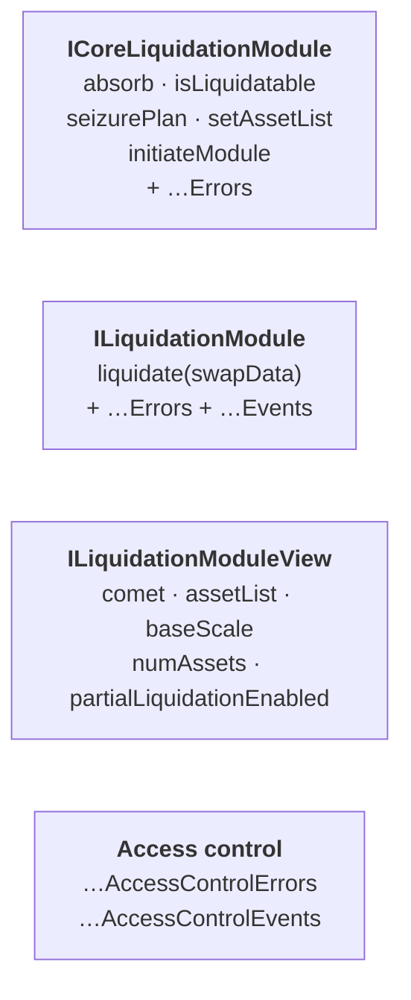

- **`ICoreLiquidationModule`** (aggregates `ICoreLiquidationModuleErrors`) — the core surface **Comet** talks to: `absorb`, the `isLiquidatable` / `seizurePlan` reads, and the one-time `setAssetList` / `initiateModule` wiring. Also declares the `Seizure` struct that the plan is made of.
- **`ILiquidationModule`** (aggregates `ILiquidationModuleErrors` + `ILiquidationModuleEvents`) — adds the executor entry point `liquidate(absorber, account, swapData)`. The deployed module implements *both* this and `ICoreLiquidationModule`.
- **`ILiquidationModuleView`** — a read-only surface (`comet`, `assetList`, `baseScale`, `numAssets`, `partialLiquidationEnabled`). This is what `LiquidationSeizureView` binds to so it can mirror the seizure math off-chain.
- **`ILiquidationAccessControlEvents` / `…Errors`** — role and pause-switch events (`DexPausedSet`, `LiquidationModeToggled`, …) and their revert reasons.

### 10.2 The DEX adapter interfaces

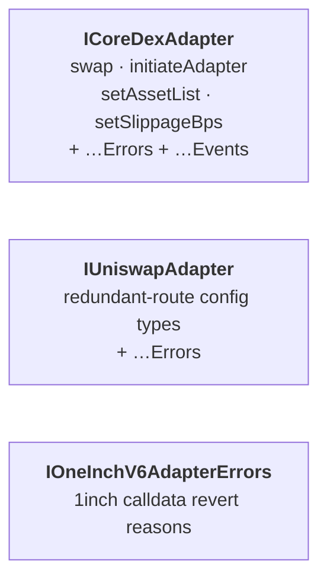

- **`ICoreDexAdapter`** (aggregates `ICoreDexAdapterErrors` + `ICoreDexAdapterEvents`) — the surface the **module** calls: `swap`, the `initiateAdapter` / `setAssetList` wiring, and `setSlippageBps`. Declares the `CollateralSlippage` struct.
- **`IUniswapAdapter`** (aggregates `IUniswapAdapterErrors`) — the redundant-route configuration types (`RouteConfig`, `RouteKind`, single vs multi-hop path shapes) needed to build and validate Uniswap routes.
- **`IOneInchV6AdapterErrors`** — the extra revert reasons the 1inch adapter adds for calldata validation (`InvalidSelector`, `InvalidTokens`, …).

### 10.3 The market interfaces the module depends on

The module doesn't hold balances — it reads the market and writes back through hooks. Those come from Comet-side interfaces:

- **`ICometInterface` / `ICometData`** — reads: `userBasic`, `userCollateral`, `presentValue`, price feeds, `baseBorrowMin`, and the like — everything the liquidatable check and seizure plan need.
- **`ICometLiquidationInterface`** — the write hooks the module calls: `updateCollateral`, `updateAndSeizeCollateral`, and `updateDebtAndPrincipal` (Chapters 6–7).
- **`IAssetList`** — per-asset config (`getAssetInfo`), and **`IPriceFeed`** — the Chainlink-style `latestRoundData` used by `getPrice`.

### 10.4 Which interface for which integration

| You want to… | Use |
|---|---|
| **Index / decode liquidation events** | `ILiquidationModuleEvents`, `ICoreDexAdapterEvents` + Comet's `AbsorbCollateral` / `AbsorbDebt` / `BuyCollateral` |
| **Decode reverts** | the `…Errors` interfaces (`ICoreLiquidationModuleErrors`, `ILiquidationModuleErrors`, `ICoreDexAdapterErrors`, `IUniswapAdapterErrors`, `IOneInchV6AdapterErrors`) |
| **Check if an account is liquidatable** | `ICoreLiquidationModule.isLiquidatable` |
| **Preview what would be seized** | `ICoreLiquidationModule.seizurePlan` (now) or `LiquidationSeizureView.seizurePlanAt` (projected to a future timestamp) |
| **Run a keeper DEX liquidation** | `ILiquidationModule.liquidate(absorber, account, swapData)` — build one 1inch calldata per planned collateral, in plan order |
| **Run a permissionless absorb** | `Comet.absorb(absorber, accounts[])` |
| **Buy absorbed collateral at a discount** | `Comet.quoteCollateral` then `Comet.buyCollateral` |
| **Build / deploy a new DEX adapter** | implement `ICoreDexAdapter`; configure routes via `IUniswapAdapter` types |

<div align="right"><a href="#table-of-contents">⬆ Back to Table of Contents</a></div>
