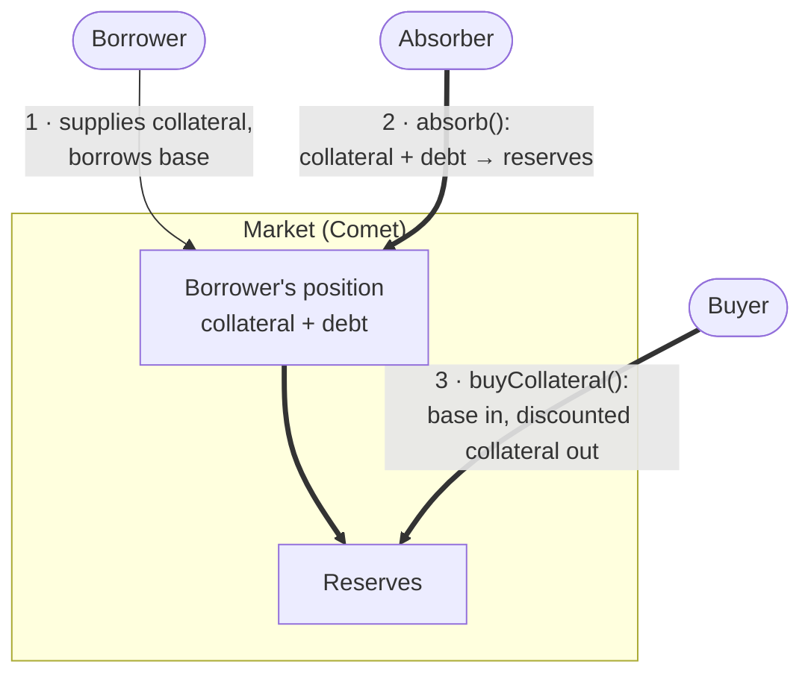
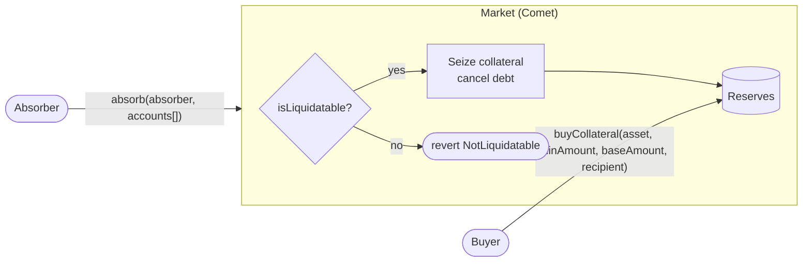

# Absorb (Liquidation)

How under-collateralized positions are closed in a Comet market: when an account becomes liquidatable, how `absorb` takes over its collateral and debt, how the protocol sells that collateral through `buyCollateral`, and what each party earns or loses.

> Reference contract: [`CometWithExtendedAssetList`](../contracts/CometWithExtendedAssetList.sol). Related: [Collateral Delisting](collateral-delisting.md) (zero factors in liquidation), [Pauses](pauses.md), [Interest Accrual](interest-accrual.md).

---

## Table of Contents

1. [Overview](#1-overview)
2. [Collateral Value and Health Factor](#2-collateral-value-and-health-factor)
3. [Mechanism of Liquidation](#3-mechanism-of-liquidation)
4. [Structure of the Protocol](#4-structure-of-the-protocol)
5. [Seizure Calculation](#5-seizure-calculation)
6. [Absorb](#6-absorb)
7. [Buy Collateral](#7-buy-collateral)
8. [Benefits for Liquidators](#8-benefits-for-liquidators)
9. [Events](#9-events)
10. [Interfaces](#10-interfaces)

---

## 1. Overview

A borrower locks up **collateral** (WETH, WBTC, …) to borrow the market's **base asset** (USDC, …). The protocol lends only a fraction of the collateral's value, which leaves a buffer between the debt and the collateral behind it.

Prices move and interest accrues, so that buffer can disappear. Once the collateral no longer covers the debt with a margin, the position is **under-collateralized**. If nothing is done, the debt could end up larger than the collateral, and lenders would bear the loss.

Comet closes such positions in **two separate steps**:

1. **`absorb`**: the protocol itself takes over the account. It seizes **all** of the account's collateral into its reserves, cancels **all** of its debt, and credits the borrower with whatever the collateral was worth beyond the debt.
2. **`buyCollateral`**: the protocol then sells the seized collateral to anyone, **at a discount**, to turn it back into base asset.

No third party repays the debt. The protocol's reserves absorb it and are paid back by the collateral sale.

### Who and what is involved

| Actor / Component | Role |
|---|---|
| **Borrower** | Holds collateral and debt. Their position is what gets absorbed. |
| **Market** (`CometWithExtendedAssetList`) | Holds every balance and price. Decides whether an account is liquidatable, absorbs it, and sells the collateral. |
| **Reserves** | The protocol's own funds inside the market. They take the debt and the collateral during `absorb`, and are paid back by `buyCollateral`. |
| **Absorber** | Anyone who calls `absorb`. Earns liquidator points, not tokens. |
| **Buyer** | Anyone who calls `buyCollateral`. Pays base, receives collateral at a discount. |



A borrower supplies collateral and borrows *(1)*. After a price move or accrued interest, the position becomes liquidatable, and anyone can absorb it *(2)*. The collateral now sits in reserves, and anyone can buy it at a discount *(3)*. That sale is what refills the base reserves.

<div align="right"><a href="#table-of-contents">⬆ Back to Table of Contents</a></div>

---

## 2. Collateral Value and Health Factor

### 2.1 The ingredients

| Ingredient | Where it comes from | Meaning |
|---|---|---|
| **Balance** | `userCollateral(account, asset).balance` | How much of the collateral the account holds, in token units |
| **Price** | `getPrice(priceFeed)` | USD price at **8 decimals** |
| **collateralLCF** | `AssetInfo.liquidateCollateralFactor` | The share of the collateral's value that counts toward the **liquidation threshold**, at 18 decimals |
| **Debt** | `presentValue(principal)` × base price | The borrow balance *including accrued interest* |

Each collateral has three factors, and only one of them decides liquidation:

- **collateralBCF** limits how much can be *borrowed*. It is not used for liquidation.
- **collateralLCF** is the **liquidation threshold**. It is always above collateralBCF (unless collateralBCF is 0), which creates the buffer between "can't borrow more" and "gets liquidated".
- **collateralLF** prices the collateral *once it is seized* ([Chapter 5](#5-seizure-calculation)).

### 2.2 Collateral value

```
collateralValue_i = balance_i × price_i / scale_i
liquidity         = Σ collateralValue_i × collateralLCF_i      over every collateral the account holds
debtValue         = presentValue(principal) × basePrice / baseScale
```

### 2.3 Health factor

Comet never stores a health factor, but the check it runs is equivalent to one:

```
health factor = liquidity / debtValue
```

| Health factor | Meaning |
|---|---|
| **≥ 1** | Collateral covers the debt at the threshold: **safe** |
| **< 1** | **Liquidatable** |

### 2.4 Worked example

| Parameter | Value |
|---|---|
| Base | USDC, $1.00 |
| Collateral | WETH, $2,000 |
| collateralBCF / collateralLCF / collateralLF | 0.80 / 0.85 / 0.90 |

A borrower supplies **10 WETH** and borrows **15,000 USDC**.

```
collateralValue = 10 × $2,000     = $20,000
liquidity       = $20,000 × 0.85  = $17,000
health factor   = 17,000 / 15,000 = 1.13     → safe
```

WETH falls to **$1,700**:

```
collateralValue = 10 × $1,700     = $17,000
liquidity       = $17,000 × 0.85  = $14,450
health factor   = 14,450 / 15,000 = 0.96     → liquidatable
```

The line is crossed at `10 × P × 0.85 = 15,000`, which is **P ≈ $1,764.71**. It rises slowly over time as interest adds to the debt.

This example continues through Chapters 5–8.

<div align="right"><a href="#table-of-contents">⬆ Back to Table of Contents</a></div>

---

## 3. Mechanism of Liquidation

### 3.1 Why a position becomes liquidatable

Anything that lowers the liquidity or raises the debt value can cross the line:

| Trigger | Example: $100 collateral, collateralLCF 86%, debt $80 |
|---|---|
| **Collateral price falls** | Collateral −12% → $88 × 86% = $75.68 < $80 |
| **Base price rises** | 80 base @ $1.10 = $88 > $86 |
| **Interest accrues** | Debt grows from $80 to $87 > $86 |
| **Governance lowers collateralLCF** | collateralLCF → 0 during [delisting](collateral-delisting.md) → threshold $0 < $80 |

### 3.2 How the protocol decides: `isLiquidatable`

1. **No debt, no liquidation.** If `principal ≥ 0`, it returns `false` before reading any price.
2. **Value the debt** at the base price. It is negative, because it is a borrow.
3. **Add each collateral's weighted value**, walking the account's assets in index order:
   - An asset with **collateralLCF = 0 is skipped** and its price feed is not read, so a delisted asset with a broken oracle cannot block liquidation.
   - Once the running total reaches 0 or more, the account is safe, and the function **returns early** without reading the remaining assets.
4. **Liquidatable if the total is still below 0.**

`isLiquidatable` values the debt with the **stored** borrow index. Called on its own as a view, it reflects the market as of its last accrual. `absorb` always accrues first, so the check it runs sees the current debt.

The prices read here are **kept and reused** by `absorb`, so each price feed is read at most once per account.

> **Deactivation does not affect this check.** A deactivated collateral still counts at its collateralLCF, and an account holding it can always be liquidated ([Pauses](pauses.md#5-collateral-deactivation)).

### 3.3 In short

- Liquidatable ⇔ **weighted collateral < debt** ⇔ health factor < 1.
- Four triggers: collateral price ↓, base price ↑, interest ↑, collateralLCF ↓.
- Zero-factor assets are skipped without touching their oracle.

<div align="right"><a href="#table-of-contents">⬆ Back to Table of Contents</a></div>

---

## 4. Structure of the Protocol



| Entry point | Who can call | Gated by | Does |
|---|---|---|---|
| **`absorb(absorber, accounts[])`** | Anyone | General pause (`isAbsorbPaused`) | Absorbs every listed account. **Reverts as a whole if any account is not liquidatable.** |
| **`buyCollateral(asset, minAmount, baseAmount, recipient)`** | Anyone | General pause (`isBuyPaused`); base reserves below `targetReserves` | Sells collateral from reserves for base, at a discount |

Everything happens in one contract, the market. There is no separate liquidation module, and there are no roles.

The two steps are **independent transactions**. Absorbing does not require buying, and a buyer can buy any collateral in reserves, not only what was just absorbed. In practice, one bot usually does both: it absorbs, then buys the collateral and sells it elsewhere.

The `absorber` argument only decides who gets the [liquidator points](#8-benefits-for-liquidators). It does not have to be the caller.

<div align="right"><a href="#table-of-contents">⬆ Back to Table of Contents</a></div>

---

## 5. Seizure Calculation

`absorb` is **all or nothing**. There is no partial liquidation: every seizable collateral is taken in full, and the whole debt is closed.

### 5.1 Per collateral

Each collateral is credited at its value times its **collateralLF**:

```
value_i  = balance_i × price_i / scale_i
credit_i = value_i × collateralLF_i
```

The gap `1 − collateralLF` is the **liquidation penalty**. For collateralLF 0.90, the borrower is credited 90% of the collateral's value.

### 5.2 For the account

```
creditInBase = Σ credit_i / basePrice
newBalance   = oldBalance + creditInBase         (oldBalance is negative: the debt)
newBalance   = max(newBalance, 0)
```

| Outcome | When | Result |
|---|---|---|
| **Surplus** | credit > debt | The debt is closed, and the rest becomes the borrower's **base supply** |
| **Exact** | credit = debt | The debt is closed, and the borrower ends at 0 |
| **Bad debt** | credit < debt | The debt is closed anyway. **Reserves pay the difference.** |

### 5.3 Zero factors

Two factors can take an asset out of this calculation. Each is a stage of [delisting](collateral-delisting.md):

| collateralLCF | collateralLF | In `absorb` |
|---|---|---|
| > 0 | > 0 | Seized, credited at `value × collateralLF` |
| > 0 | 0 | **Skipped.** It stays with the borrower. |
| 0 | > 0 | Seized, **credited at $0**: its price was never read, because `isLiquidatable` skipped the asset |
| 0 | 0 | **Skipped.** It stays with the borrower. |

### 5.4 The example, continued

WETH at $1,700, debt 15,000 USDC, collateralLF 0.90:

```
value        = 10 × $1,700    = $17,000
credit       = $17,000 × 0.90 = $15,300
newBalance   = −15,000 + 15,300 = +300 USDC      → surplus
```

The borrower's debt is gone, and they keep **300 USDC** of base supply. Their penalty is $17,000 − $15,300 = **$1,700** (10%).

**The same position with WETH at $1,400:**

```
credit     = $14,000 × 0.90 = $12,600
newBalance = −15,000 + 12,600 = −2,400 → 0      → bad debt of 2,400 USDC paid by reserves
```

<div align="right"><a href="#table-of-contents">⬆ Back to Table of Contents</a></div>

---

## 6. Absorb

### 6.1 What happens, in order

1. **Pause check.** A paused absorb reverts the whole call.
2. **Accrue** the market once, for all accounts.
3. **Per account:**
   - It must be liquidatable, or the whole call reverts with `NotLiquidatable`.
   - For each collateral with collateralLF > 0: set the user's balance to 0, reduce `totalsCollateral.totalSupplyAsset`, and emit `AbsorbCollateral`.
   - Set the principal from `newBalance` (Chapter 5).
   - Reset `assetsIn` to empty. Assets skipped because their collateralLF is 0 keep their balance, but no longer count as "in" for the account.
   - Update the market totals. The closed debt leaves `totalBorrowBase`, and any surplus joins `totalSupplyBase`.
   - Emit `AbsorbDebt`. Also emit `Transfer` if the borrower ends with a positive balance.
4. **Record liquidator points** for `absorber`.

### 6.2 Where the value goes

Nothing leaves the contract during `absorb`: no tokens are transferred. Only the accounting changes:

| | Base reserves | Collateral reserves |
|---|---|---|
| Debt closed | ↓ by the whole debt | |
| Surplus credited to the borrower | ↓ by the surplus | |
| Collateral seized | | ↑ by the seized amount |

Base reserves are `balance − totalSupply + totalBorrow`, and collateral reserves are `balance − totalSupplyAsset`. So removing borrow and adding supply both lower base reserves, and removing collateral supply raises collateral reserves.

**Example, continued (WETH at $1,700):**

```
base reserves        −15,000 (debt)  −300 (surplus)  = −15,300 USDC
collateral reserves  +10 WETH (worth $17,000)
```

The protocol has swapped 15,300 USDC of reserves for 10 WETH. `buyCollateral` turns that back into USDC.

<div align="right"><a href="#table-of-contents">⬆ Back to Table of Contents</a></div>

---

## 7. Buy Collateral

### 7.1 When it sells

`buyCollateral` sells only while the protocol **needs base**:

- Base reserves must be **below `targetReserves`**, or negative. Otherwise it reverts with `NotForSale`.
- The amount bought must fit in that asset's **collateral reserves**. Otherwise it reverts with `InsufficientReserves`.

### 7.2 The price

```
discount     = storeFrontPriceFactor × (1 − collateralLF)
price        = oraclePrice × (1 − discount)
collateralOut = baseIn × basePrice / price          (converted to the asset's units)
```

`storeFrontPriceFactor` (0 to 1) decides how much of the liquidation penalty goes to the buyer. The rest stays with the protocol.

- An asset with **collateralLF = 0 is sold without a discount**, at the oracle price. An asset that isn't liquidated needs no liquidation incentive.
- The asset's price feed is **always read**. If it reverts, the asset can't be bought.
- `minAmount` protects the buyer: if the price moved and less collateral would come out, the call reverts with `TooMuchSlippage`.
- `quoteCollateral(asset, baseAmount)` returns the same figure as a view.

### 7.3 The example, continued

WETH at $1,700, collateralLF 0.90, `storeFrontPriceFactor` 0.5:

```
discount = 0.5 × (1 − 0.90) = 5%
price    = $1,700 × 0.95    = $1,615 per WETH
10 WETH  = 16,150 USDC
```

| Party | Result |
|---|---|
| Borrower | Had $2,000 of equity ($17,000 − $15,000), kept $300. **Lost $1,700**, the full 10% penalty. |
| Protocol | Paid 15,300 USDC in `absorb`, received 16,150 USDC in `buyCollateral`. **+850 USDC** |
| Buyer | Paid 16,150 USDC for WETH worth $17,000. **+$850** |

With `storeFrontPriceFactor` 0.5, the penalty is split evenly between the protocol and the buyer.

**The bad-debt case** (WETH at $1,400): reserves pay 15,000 USDC. The 10 WETH sells at $1,330 each, for 13,300 USDC, so the protocol **loses 1,700 USDC**.

<div align="right"><a href="#table-of-contents">⬆ Back to Table of Contents</a></div>

---

## 8. Benefits for Liquidators

| Step | Who earns | How | Capital needed |
|---|---|---|---|
| `absorb` | The `absorber` | **Liquidator points** only | Gas |
| `buyCollateral` | The buyer | The **discount**, in collateral | Base to pay for the collateral |

### 8.1 Liquidator points

Each `absorb` call updates `liquidatorPoints[absorber]`:

| Field | Adds |
|---|---|
| `numAbsorbs` | 1 per call |
| `numAbsorbed` | Number of accounts in the call |
| `approxSpend` | `gasUsed × block.basefee`, an estimate of the gas cost |

Points are **not paid out** by the contract. The code calls them "an imperfect tool for governance". They are a record governance can use to reward absorbers off-chain. By themselves, absorbing costs gas and earns nothing.

### 8.2 The discount

The real income is buying absorbed collateral below market (Chapter 7). A bot that absorbs an account and immediately buys and resells its collateral earns:

```
profit ≈ collateralValue × storeFrontPriceFactor × (1 − collateralLF)  −  gas  −  resale slippage
```

For the running example that is ≈ **$850**. Riskier collateral, with a lower collateralLF, carries a bigger discount: the protocol pays more to offload what is harder to sell.

<div align="right"><a href="#table-of-contents">⬆ Back to Table of Contents</a></div>

---

## 9. Events

### 9.1 Liquidation events

All events are emitted by the market.

| Event | Fires |
|---|---|
| `AbsorbCollateral(absorber, borrower, asset, collateralAbsorbed, usdValue)` | Once per seized collateral |
| `AbsorbDebt(absorber, borrower, basePaidOut, usdValue)` | Once per absorbed account |
| `Transfer(address(0), borrower, amount)` | Once per absorbed account that ends with a surplus |
| `BuyCollateral(buyer, asset, baseAmount, collateralAmount)` | Once per purchase |

- `AbsorbCollateral.usdValue` is the collateral's full USD value (`balance × price`), **before** collateralLF. It is `0` for an asset seized at $0 credit (collateralLCF = 0, collateralLF > 0).
- `AbsorbDebt.basePaidOut` is `newBalance − oldBalance`: the whole debt closed, plus any surplus. That includes any part paid by reserves. `usdValue` is that amount in USD.
- `Transfer` is the borrower's new base supply, in base units.

### 9.2 The order events fire

```
absorb(absorber, [account]):
  per seized collateral:  AbsorbCollateral
  once per account:       AbsorbDebt
                          Transfer          (only on surplus)

buyCollateral (a separate transaction):
                          BuyCollateral
```

<div align="right"><a href="#table-of-contents">⬆ Back to Table of Contents</a></div>

---

## 10. Interfaces

### 10.1 Functions

| Function | Kind | Purpose |
|---|---|---|
| `absorb(address absorber, address[] accounts)` | write | Absorb liquidatable accounts |
| `buyCollateral(address asset, uint minAmount, uint baseAmount, address recipient)` | write | Buy collateral from reserves |
| `isLiquidatable(address account)` | view | Is the account liquidatable now? Uses the stored index. |
| `quoteCollateral(address asset, uint baseAmount)` | view | Collateral out for a given base amount |
| `getReserves()` | view | Base reserves, with interest accrued to now |
| `getCollateralReserves(address asset)` | view | Collateral available to buy |
| `targetReserves()`, `storeFrontPriceFactor()` | view | Sale gate and discount share |
| `liquidatorPoints(address)` | view | An absorber's points |

All of them are declared in `CometMainInterface` / `CometInterface`.

### 10.2 Errors

| Error | Raised by | When |
|---|---|---|
| `Paused()` | `absorb` / `buyCollateral` | General absorb or buy pause is set |
| `NotLiquidatable()` | `absorb` | An account in the list is not liquidatable |
| `NotForSale()` | `buyCollateral` | Base reserves are at or above `targetReserves` |
| `TooMuchSlippage()` | `buyCollateral` | Less collateral than `minAmount` |
| `InsufficientReserves()` | `buyCollateral` | Not enough of the asset in reserves |
| `BadPrice()` | both | A price read was 0 or negative |

### 10.3 Which call for which task

| You want to… | Use |
|---|---|
| Find liquidatable accounts | `isLiquidatable`, after `accrueAccount` for an exact answer |
| Liquidate | `absorb(yourAddress, accounts)`. Filter out non-liquidatable accounts first: one bad entry reverts the batch. |
| Check whether collateral is for sale | `getReserves() < targetReserves()` and `getCollateralReserves(asset)` |
| Price a purchase | `quoteCollateral(asset, baseAmount)` |
| Buy | `buyCollateral(asset, minAmount, baseAmount, recipient)` |
| Index liquidations | `AbsorbCollateral`, `AbsorbDebt`, `BuyCollateral` |

### 10.4 Tests

| Area | File |
|---|---|
| Absorb, factor combinations, 24 assets, oracle reverts | [`test/absorb-test.ts`](../test/absorb-test.ts) |
| Liquidatable check | [`test/is-liquidatable-test.ts`](../test/is-liquidatable-test.ts) |
| Quote and discount | [`test/quote-collateral-test.ts`](../test/quote-collateral-test.ts) |
| Buy collateral | [`test/buy-collateral-test.ts`](../test/buy-collateral-test.ts) |

<div align="right"><a href="#table-of-contents">⬆ Back to Table of Contents</a></div>
