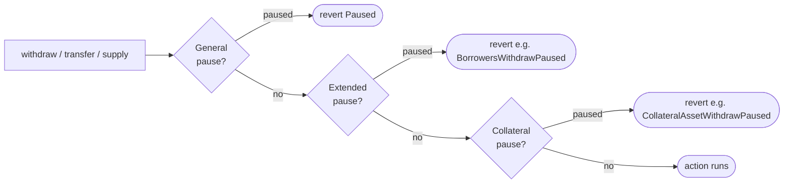
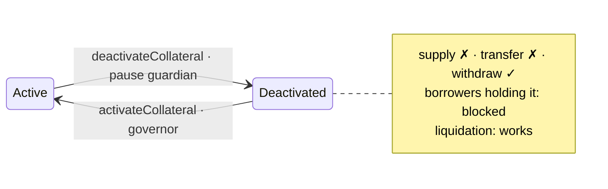

# Pauses

How Comet stops user actions in an emergency: the original market-wide pause, the finer-grained extended pauses, per-collateral pauses, and collateral deactivation.

> Reference contracts: [`CometWithExtendedAssetList`](../contracts/CometWithExtendedAssetList.sol) (checks and views), [`CometExt`](../contracts/CometExt.sol) (setters), [`CometStorage`](../contracts/CometStorage.sol) (flags), [`CometCore`](../contracts/CometCore.sol) (offsets).

---

## Table of Contents

1. [Overview](#1-overview)
2. [General Pause](#2-general-pause)
3. [Extended Pause](#3-extended-pause)
4. [Collateral Pause](#4-collateral-pause)
5. [Collateral Deactivation](#5-collateral-deactivation)
6. [Reference](#6-reference)

---

## 1. Overview

Comet has four layers of pausing. Each one is narrower than the one above it:

| Layer | Scope | Pause | Unpause |
|---|---|---|---|
| **General pause** | A whole action: supply, transfer, withdraw, absorb or buy | Governor or pause guardian | Governor or pause guardian |
| **Extended pause** | One side of an action: lenders vs borrowers, base vs collateral | Governor or pause guardian | Governor or pause guardian |
| **Collateral pause** | One action on one collateral asset | Governor or pause guardian | Governor or pause guardian |
| **Collateral deactivation** | One collateral asset, including the borrowers who hold it | Pause guardian only | Governor only |

The **governor** is the protocol's governance timelock. The **pause guardian** is a separate address set in the market configuration so that emergencies can be handled without waiting for a governance vote.

Every flag is a single bit in a bitmap stored on the market. A user action passes through the layers from the broadest to the narrowest, and the first paused flag it meets makes it revert:



Deactivation works a little differently. It sets collateral-pause bits, and it also blocks borrowers who hold the asset (see [section 5](#5-collateral-deactivation)).

**Liquidation keeps working under every flag except its own.** `absorb` and `buyCollateral` are gated only by the general pause. No extended pause, collateral pause or deactivation stops them.

The setters live in `CometExt` and are reached through the market's fallback. So they are called on the market address like any other function, for example `comet.pauseBorrowersWithdraw(true)`. The views (`isXxxPaused`) live on the market itself.

<div align="right"><a href="#table-of-contents">⬆ Back to Table of Contents</a></div>

---

## 2. General Pause

The original Comet switch. A single call sets all five flags at once:

```solidity
function pause(bool supplyPaused, bool transferPaused, bool withdrawPaused, bool absorbPaused, bool buyPaused) external;
```

| Flag | Blocks | View |
|---|---|---|
| supply | `supply`, `supplyTo`, `supplyFrom` (base and collateral) | `isSupplyPaused()` |
| transfer | `transfer*` and `transferAsset*` (base and collateral) | `isTransferPaused()` |
| withdraw | `withdraw`, `withdrawTo`, `withdrawFrom` (base and collateral) | `isWithdrawPaused()` |
| absorb | `absorb` | `isAbsorbPaused()` |
| buy | `buyCollateral` | `isBuyPaused()` |

- **Who:** governor or pause guardian, for both pausing and unpausing. Anyone else gets `Unauthorized`.
- **Where:** `pauseFlags` (`uint8`) on the market. The call and the views are in `CometWithExtendedAssetList`.
- **Revert:** `Paused()`.
- **Event:** `PauseAction(supplyPaused, transferPaused, withdrawPaused, absorbPaused, buyPaused)`.

> `pause` **overwrites all five flags**. To change one flag, pass the current value for the other four, otherwise they are silently reset.

<div align="right"><a href="#table-of-contents">⬆ Back to Table of Contents</a></div>

---

## 3. Extended Pause

### Why it exists

The general pause is all or nothing. Pausing `withdraw` to stop new borrowing also stops lenders from taking their money out. Pausing `supply` to stop a risky collateral also stops borrowers from repaying their debt.

Extended pauses split each action into the parts that behave differently in an incident, so the response can be as narrow as the problem:

| Situation | Response | Still works |
|---|---|---|
| Stop new debt (bad oracle, exploit in progress, liquidity crunch) | `pauseBorrowersWithdraw` + `pauseBorrowersTransfer` | Lenders exit, borrowers repay and add collateral, liquidations |
| Stop lenders leaving during a bank run | `pauseLendersWithdraw` (+ `pauseLendersTransfer`) | Borrowing rules unchanged, repayments |
| Freeze all collateral movement at once | `pauseCollateralSupply` / `Withdraw` / `Transfer` | Base asset flows |
| Stop new deposits of the base asset | `pauseBaseSupply` | Everything else |

### Flags

Eight flags live in `extendedPauseFlags` (`uint24`), one bit each:

| Bit | Setter | Blocks | Revert | View |
|---|---|---|---|---|
| 0 | `pauseLendersWithdraw` | Base withdraw by a lender | `LendersWithdrawPaused` | `isLendersWithdrawPaused()` |
| 1 | `pauseBorrowersWithdraw` | Base withdraw by a borrower | `BorrowersWithdrawPaused` | `isBorrowersWithdrawPaused()` |
| 2 | `pauseCollateralSupply` | Supply of any collateral | `CollateralSupplyPaused` | `isCollateralSupplyPaused()` |
| 3 | `pauseBaseSupply` | Supply of the base asset, **including repayments** | `BaseSupplyPaused` | `isBaseSupplyPaused()` |
| 4 | `pauseLendersTransfer` | Base transfer by a lender | `LendersTransferPaused` | `isLendersTransferPaused()` |
| 5 | `pauseBorrowersTransfer` | Base transfer by a borrower | `BorrowersTransferPaused` | `isBorrowersTransferPaused()` |
| 6 | `pauseCollateralTransfer` | Transfer of any collateral | `CollateralTransferPaused` | `isCollateralTransferPaused()` |
| 7 | `pauseCollateralWithdraw` | Withdraw of any collateral | `CollateralWithdrawPaused` | `isCollateralWithdrawPaused()` |

For example, `extendedPauseFlags = 0b00001010` (bits 1 and 3) means borrowers cannot withdraw base and nobody can supply base. All other extended actions are open.

- **Who:** governor or pause guardian, for both pausing and unpausing. Anyone else gets `OnlyPauseGuardianOrGovernor`.
- **Signature:** `pauseXxx(bool paused)`. Each call changes exactly one bit.
- **No-op protection:** setting a flag to the value it already has reverts with `OffsetStatusAlreadySet(offset, status)`.
- **Event:** one per setter, named after it (for example `BorrowersWithdrawPauseAction(bool)`).

### Lender or borrower?

The market has no stored "role" for an account. The role is decided by **the account's base balance after the action**:

- The balance is still ≥ 0 → the action is a **lender** action.
- The balance goes below 0 → the action is a **borrower** action.

Only the sender's side (`src`) is checked. The receiver of a transfer does not matter.

**Example.** Alice has supplied 1,000 USDC.

| Alice calls | Balance after | Treated as | Blocked by |
|---|---|---|---|
| `withdraw(USDC, 400)` | +600 | lender | `pauseLendersWithdraw` |
| `withdraw(USDC, 1,000)` | 0 | lender | `pauseLendersWithdraw` |
| `withdraw(USDC, 1,500)` | −500 | borrower | `pauseBorrowersWithdraw` |

The last call is a borrower action as a whole. Even the 1,000 USDC that was Alice's own is not withdrawn while borrowers are paused.

> **`pauseBaseSupply` also blocks repayment.** Repaying debt is a base supply. While it is paused, borrowers cannot reduce their debt, and positions can drift toward liquidation as interest accrues.

<div align="right"><a href="#table-of-contents">⬆ Back to Table of Contents</a></div>

---

## 4. Collateral Pause

The same idea as the extended collateral flags, applied to **one asset**. Each action has its own bitmap, with bit `i` standing for the asset at index `i` (`AssetInfo.offset`, the order from `getAssetInfo`). With `uint24` bitmaps, up to 24 collaterals are supported.

| Setter | Bitmap | Blocks | Revert | View |
|---|---|---|---|---|
| `pauseCollateralAssetSupply(i, paused)` | `collateralsSupplyPauseFlags` | Supply of asset `i` | `CollateralAssetSupplyPaused(i)` | `isCollateralAssetSupplyPaused(i)` |
| `pauseCollateralAssetWithdraw(i, paused)` | `collateralsWithdrawPauseFlags` | Withdraw of asset `i` | `CollateralAssetWithdrawPaused(i)` | `isCollateralAssetWithdrawPaused(i)` |
| `pauseCollateralAssetTransfer(i, paused)` | `collateralsTransferPauseFlags` | Transfer of asset `i` | `CollateralAssetTransferPaused(i)` | `isCollateralAssetTransferPaused(i)` |

For example, `collateralsSupplyPauseFlags = 0b101` means supply of assets 0 and 2 is paused, while asset 1 can still be supplied.

- **Who:** governor or pause guardian, for both pausing and unpausing (`OnlyPauseGuardianOrGovernor`).
- **Index check:** `i >= numAssets` reverts with `InvalidAssetIndex`.
- **No-op protection:** setting the current value reverts with `CollateralAssetOffsetStatusAlreadySet(flags, i, status)`. The first argument is the whole current bitmap, not an offset.
- **Deactivated assets:** supply and transfer of a deactivated asset **cannot be unpaused** (`CollateralIsDeactivated(i)`). Reactivate it instead (see [section 5](#5-collateral-deactivation)). Withdraw has no such restriction.
- **Events:** `CollateralAssetSupplyPauseAction(i, paused)`, `CollateralAssetWithdrawPauseAction(i, paused)`, `CollateralAssetTransferPauseAction(i, paused)`.

The collateral-wide flag from [section 3](#3-extended-pause) and the per-asset flag are independent. An action goes through only if **both** are open.

<div align="right"><a href="#table-of-contents">⬆ Back to Table of Contents</a></div>

---

## 5. Collateral Deactivation

### Why it exists

A collateral pause stops new movement of an asset, but borrowers who already hold it keep borrowing against it. If the asset itself is compromised (a depeg, a token exploit, a broken bridge), that existing borrowing power is the risk. Deactivation removes the asset from use in one step: nobody can bring more in, and nobody can borrow against it, but everyone can still take it out.

### Deactivate and activate

```solidity
function deactivateCollateral(uint24 assetIndex) external; // pause guardian only
function activateCollateral(uint24 assetIndex) external;   // governor only
```

The roles are deliberately split. Deactivation is an emergency action, so the pause guardian can take it immediately. Reactivation means trusting the asset again, so it needs governance.

| | `deactivateCollateral(i)` | `activateCollateral(i)` |
|---|---|---|
| Caller | Pause guardian (`OnlyPauseGuardian`) | Governor (`OnlyGovernor`) |
| Precondition | Not already deactivated (`CollateralIsDeactivated(i)`) | Currently deactivated (`CollateralIsActivated(i)`) |
| `deactivatedCollaterals` bit `i` | set | cleared |
| Supply pause for `i` | set | cleared |
| Transfer pause for `i` | set | cleared |
| Events | `CollateralDeactivated`, `CollateralAssetSupplyPauseAction(i, true)`, `CollateralAssetTransferPauseAction(i, true)` | `CollateralActivated`, `CollateralAssetSupplyPauseAction(i, false)`, `CollateralAssetTransferPauseAction(i, false)` |

> Activation clears the supply and transfer pauses **unconditionally**. If asset `i` had been paused separately before it was deactivated, activation unpauses it too.

### What it does to users

| Account | Effect |
|---|---|
| **Holds the asset, no debt** | Can withdraw it. Cannot supply or transfer it. |
| **Holds the asset, has debt** | Any action that runs the borrow collateral check (borrow, withdraw other collateral, transfer base or collateral) reverts with `TokenIsDeactivated(asset)`. |
| **Does not hold the asset** | Unaffected. |

A borrower who holds a deactivated asset has two ways out:

1. **Repay** until their base balance is ≥ 0. The borrow collateral check is then skipped entirely, and the asset can be withdrawn.
2. **Withdraw all of the deactivated asset.** A full withdrawal removes the asset from the account, so the collateral check no longer sees it. This succeeds only if the remaining active collateral still covers the debt. A partial withdrawal does not help, because the asset stays on the account.

If neither is possible, the borrower waits for liquidation.

> The collateral check walks the account's assets in index order and returns as soon as the debt is covered. The `TokenIsDeactivated` revert fires only if the check actually reaches the deactivated asset. If active assets with a lower index already cover the debt, the action goes through.

### Liquidation still works

`isLiquidatable` deliberately ignores deactivation, so a stuck borrower can always be liquidated. During `absorb`, the deactivated asset is treated like any other collateral: it is seized and valued using its collateralLF. If its collateralLF is 0, it is skipped and stays on the account.

Deactivation does **not** protect against a broken price feed. `isLiquidatable` still reads the asset's price, so if the feed reverts, liquidation of accounts holding the asset reverts too. The fix for that is governance setting the asset's collateralLCF to 0, which makes the check skip the asset and its feed.



<div align="right"><a href="#table-of-contents">⬆ Back to Table of Contents</a></div>

---

## 6. Reference

### Storage

| Variable | Type | Contract | Content |
|---|---|---|---|
| `pauseFlags` | `uint8` | `CometStorage` | General pause, 5 bits |
| `extendedPauseFlags` | `uint24` | `CometStorage` | Extended pause, 8 bits |
| `collateralsSupplyPauseFlags` | `uint24` | `CometStorage` | Per-asset supply pause |
| `collateralsWithdrawPauseFlags` | `uint24` | `CometStorage` | Per-asset withdraw pause |
| `collateralsTransferPauseFlags` | `uint24` | `CometStorage` | Per-asset transfer pause |
| `deactivatedCollaterals` | `uint24` | `CometStorage` | Per-asset deactivation |

All six are public, so the raw bitmaps can be read directly as well as through the `isXxx` views.

### Errors

| Error | Raised when |
|---|---|
| `Paused()` | General pause flag is set |
| `LendersWithdrawPaused`, `BorrowersWithdrawPaused`, `CollateralWithdrawPaused`, `CollateralSupplyPaused`, `BaseSupplyPaused`, `LendersTransferPaused`, `BorrowersTransferPaused`, `CollateralTransferPaused` | Matching extended flag is set |
| `CollateralAssetSupplyPaused(i)`, `CollateralAssetWithdrawPaused(i)`, `CollateralAssetTransferPaused(i)` | Matching per-asset flag is set |
| `TokenIsDeactivated(asset)` | Borrower holds a deactivated asset |
| `Unauthorized` | `pause` called by someone other than governor or guardian |
| `OnlyPauseGuardianOrGovernor` | Extended or per-asset setter called by someone else |
| `OnlyPauseGuardian` / `OnlyGovernor` | `deactivateCollateral` / `activateCollateral` called by the wrong role |
| `OffsetStatusAlreadySet(offset, status)` | Extended flag already has that value |
| `CollateralAssetOffsetStatusAlreadySet(flags, i, status)` | Per-asset flag already has that value |
| `InvalidAssetIndex` | `i >= numAssets` |
| `CollateralIsDeactivated(i)` | Deactivating twice, or unpausing supply/transfer of a deactivated asset |
| `CollateralIsActivated(i)` | Activating an asset that is not deactivated |

### Tests

| Area | File |
|---|---|
| Extended and per-asset setters | [`test/extended-pause-test.ts`](../test/extended-pause-test.ts) |
| Deactivation and activation | [`test/collateral-deactivation-test.ts`](../test/collateral-deactivation-test.ts) |
| Pauses applied to user actions | [`test/supply-test.ts`](../test/supply-test.ts), [`test/withdraw-test.ts`](../test/withdraw-test.ts), [`test/transfer-test.ts`](../test/transfer-test.ts) |
| Upgrade of a live market | [`test/upgrades/extended-pause-upgrade-test.ts`](../test/upgrades/extended-pause-upgrade-test.ts) |

<div align="right"><a href="#table-of-contents">⬆ Back to Table of Contents</a></div>
